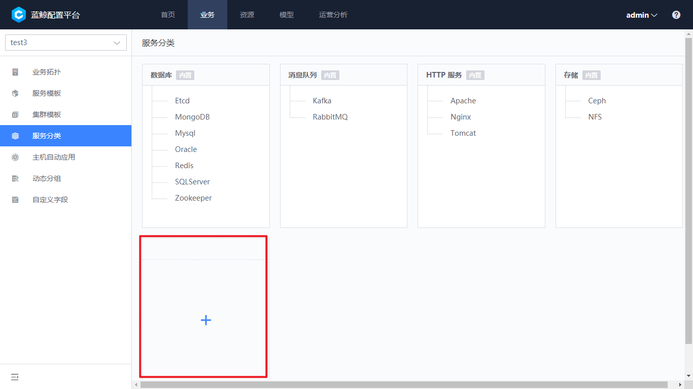

 # Service Classification 

 Service Classification can help Business sort out the purpose of services.  CMDB initialization contains some common Service Classification and supports more classifications according to Business expansion. 

 ## View current Service Classification 

 Enter "Business-Service Classification" to view current service classification. 

 There are two Service Classification, built-in or user.  The built-in Service Classification is in Business Manage and cannot be Revise or delete. 

  
 
Figure 1: Service Classification Query
 

 ## Add a Service Classification 

 In Business Manage, user can create business-specific Service Classification.  That is, Business Service Doc Category Name can be duplicated. 

 click the dotted box to create the One level of Service Classification. 

  
 
Figure 2: add Level One Service Classification
 

 Then click on more in the upper right corner to new a Two level of Service Classification.  It should be noted that only the second level of Service Classification can be setting into the service template or module. 

  
 
Figure 3: add Secondary Service Classification
 

 ## Edit/delete Service Classification 

 Hover over the Service Classification to view the edit delete Operation of the service category. 

  
 
Figure 4: edit and delete Service Classification
 