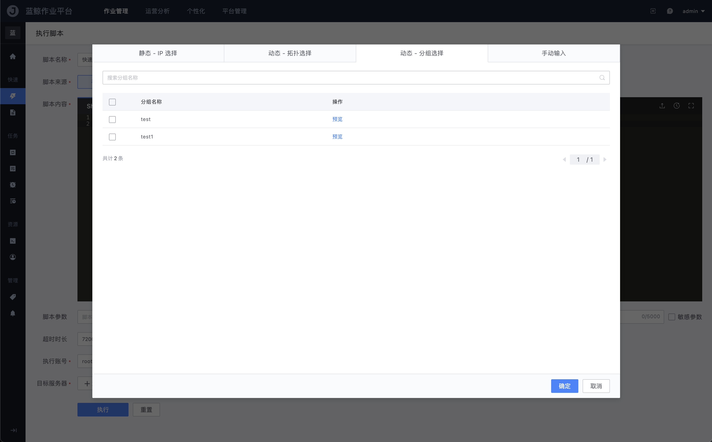

 # How CMDB Manage Host 

 ## Scenario 

 New Business Name (common Three architecture: Access layer, logic layer, and Storage layer. CMDB is needed to Manage the Host resources that the Business Name depends on to go online, so as to facilitate the subsequent auto of Scene such as Release, change, and Troubleshooting. 

 ## Prerequisites 

 In the CMDB,[add New Business Name](../QuickStart/case1.md), and import and assign hosts to your Business Name. 

 # Operation 

 - Sort out the Business Name architecture 
 - add Set 
 - add module 
 - Usage Scene: Query the Disk usage of the access layer in the Job System 

 ### Combing Business Name architecture 

 The architecture design of the Business Name is ultimately reflected in the business topology tree of the CMDB. Therefore, we first sort out the architecture of the business. 

 Take the Business Name "demo" as an example, its architecture is a common Three architecture: `Access Layer` -> `Logical Layer` -> `Storage Layer` 

 In order to meet the needs of user all over the country to access nearby, different areas are divided According to regions, but the architecture is consistent. 

  

 ### add a Set 

 According to above Business Name architecture, the following correspondence can be made: 

 - Set <->in the Business Name in CMDB 
 - Hierarchical architecture in the Business Name in <->CMDB 

 In `Business Name resources` -&gt; `Business Topology`, select the root node `Business` and create a new zone of node `Set One. 

  

 After complete create, you can see the properties of the Current cluster in Node information 

 &gt; Type: generally remain `formal`; Set the Test environment to `test`, so that only `test` Set can be select for the Release Flow template of the test environment; 

 &gt; service Status: Generally, it is `open`. In some Scene such as when preparing to open an area, the status can be set to `close`, so that the Release system cannot select it. 

  

 After add `Zone One` and `Zone Two` of the cluster, you can see the following Business Name topology. 

  

 Next, create the module under the Set. 

 ### add a module 

 Select the `Set` node to add module. 

  

  

 &gt; Service Classification is used to identify the actual functional Components of the current module, for example mysql components, Nginx components, and even customize components of the Business Name. 

 After complete create, you can see the detail of the current module in "Node information". 

 &gt; module Type: generally `Normal`. If the module type is Database class, select `Database`. 
 &gt; Main maintainer and backup maintainer: The module maintainer is generally used during Alert Push; The difference is that `primary maintainer` is preferred when Phone. If `primary maintainer` does not answer the call, the call will be auto transferred to `backup maintainer`. The logic here needs to be implemented by yourself. 

  

 After the module is create,[Assign Host](../QuickStart/case1.md#Allocate Host to Business Name Idle CVM Pool). Allocate the resources in `CVM resources` -&gt; `CVM` to the corresponding module According to business architecture; 

  

 ### Usage Scene: Query the Disk usage of the access layer in the Job System 

 Experience [Job System](../../../JobSystem/UserGuide/Introduction/What-is-Job.md) how to consume Host instances. 

 media/cmdb_job_consume.mp4 

 ## Extended Reading 

 ### CMDB Consumption Scene of BlueKing Built-in SaaS 
 #### Apply Release and change: resources Orchestration Tool Standard OPS 

 The Apply Release and change Flow includes file distribution and command execute of version on multiple host. To select these CVMs gracefully, you need to use the CMDB Query host instance function. 

  
 
(pipelinesHistory of One Apply delivery in Standard OPS)
 

 By using the `dynamic IP` var in the Parameter, **OPS does not need to be concerned about the changes of CVMs caused by Scene such as Host Shrinkage capacity and fault Replace**, and does not need to worry about missing or wrong CVMs being updated. 

  

 #### Troubleshooting: monitoring and Fault Auto-recovery 

 Set an [Alert Detection Alert Rules](../../../Monitor/UserGuide/functions/conf/rules.md)for a certain layer module (such as access layer) in the Business Name architecture., you do not need to care about the new, delete and Revise of instances. 

  

 The logic behind how to realize Real time awareness is to realize the actions such as new, Revise and delete instances in real time approve the event Push function of CMDB. 

  

 In [Fault Auto-recovery](../../../ThesameistruefortheconsumptionSceneinFaultAuto-recovery/UserGuide/Intro/README.md), where One or more Modules Alert and link corresponding processing actions. 

  

 #### Management and control of resources by platform team, for example Business Name DBA and AIX SA 

 Take DBA as an example. To control all DBs, you can Set the module type of the Host Database to `Database`, and then query the host whose module type is `Database` approve the `dynamicGroup` function. 

  

 On the [BlueKing Job System](../../../../JobSystem/UserGuide/Introduction/What-is-Job.md). 

  

 ### What should I do if a three-level topology is not enough?  add Multilevel Topology node 

 If the Business Name architecture has One level (platform: For example,`Android_Weixin`,`Android_QQ`, etc.). 

  

 You can insert One or more levels of topology between `Business Name` and `Set` in `model relationship` 

  

 The new Business Name topology is as follows: 

  