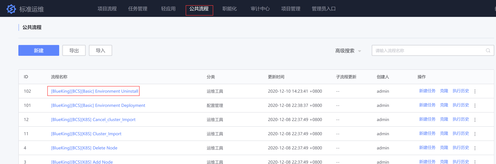

### 卸载详细步骤

1. 注意事项

   - 为了保证数据安全，卸载任务不会对 MYSQL、Redis、MongoDB 数据库进行操作，如要清理，请自行清理，对应服务名称分别为：mysql@bcs、redis@bcs、mongod
   - 卸载任务不会对 K8S 集群进行操作，在卸载容器管理平台前请先在容器管理平台的 SaaS 里删除节点与集群
   - 卸载任务不会删除文件，操作的步骤只有停止并关闭 service，把/data/bkce 和/data/bcs 重命名为以当时操作时间为后缀的目录

2. 打开标准运维--->公共流程--->[BlueKing][BCS][Basic] Environment Uninstall--->新建任务
   

3. 选择 容器管理平台后台服务器所在业务
   

4. 节点选择，不用修改，直接进入下一步
   

5. 参数填写

   
   

<table><tbody>
<tr><td width="10%">安装包与安装脚本存放路径</td><td width="90%">社区版安装包（src 目录）、安装脚本存放路径（install 目录）和安装后文件存放路径（bkce），默认为/data，建议选择一个大一点的数据分区挂载路径</td></tr>
<tr><td width="10%">BCS 后台服务 IP 地址</td><td width="90%">容器管理平台后台服务部署的 IP 地址，容器管理平台后台服务包括 bcs-api、bcs-dns-service、bcs-storage、bcs-cc，同时还会部署容器管理平台后台服务所依赖的 etcd 与 zookeeper 服务，体验环境使用 1 台服务器即可，生产环境建议使用 3 台服务器做高可用，多个 IP 使用半角逗号分隔，不要使用偶数台（2 或者 4）服务器，否则安装 zookeeper 服务会失败</td></tr>
<tr><td width="10%">BCS 导航页组件 IP 地址</td><td width="90%">部署项目信息管理服务 IP 地址，负责项目创建及基本信息管理，生产环境建议用 2 台服务器做高可用，多个 IP 使用半角逗号分隔，此 IP 需要在客户端浏览器可访问</td></tr>
<tr><td width="10%">Web Console IP 地址</td><td width="90%">部署在提供 kubectl 命令行工具 IP 地址，可以使用 web 页面快捷查看集群内资源，生产环境建议用 2 台服务器做高可用，多个 IP 使用半角逗号分隔</td></tr>
<tr><td width="10%">BCS 监控 IP 地址</td><td width="90%">部署容器监控服务的 IP 地址，目前只支持单个 IP</td></tr>
<tr><td width="10%">Harbor 私有仓库 IP 地址</td><td width="90%">部署私有镜像仓库的 IP 地址，使用 Harbor 提供私有仓库服务，如果需要存放的镜像较多，需要部署在磁盘空间稍大的服务器上，目前只支持部署 1 台服务器；此 IP 需要在客户端浏览器可访问，访问 Harbor 页面管理方式为http://{外网 IP}，管理员用户名默认为：admin，密码为：Harbor12345</td></tr>
</tbody></table>

6. 执行部署作业，执行作业过程中没有出现错误即部署正常，否则需要根据 job 执行错误信息解决问题
  
