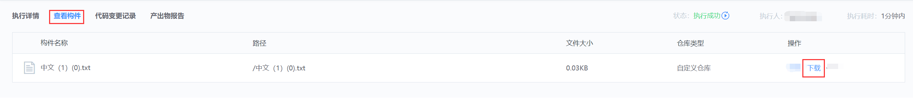

# 下载制品

## 在流水线运行过程中自动下载

构件归档到制品库后，可以在下游添加新的构建环境`Job 3-1`

添加并配置`Downlad artifacts`插件，用以拉取已上传至制品库的构件

执行流水线，通过插件日志检查构件是否拉取成功

## 在流水线中手动下载

进入流水线执行详情，查看构件 tab，可以手动下载已归档的构件

## 在制品库中手动下载

进入制品库对应仓库下，找到待下载的构件进行下载

## 接下来你可能需要

* [制品库](Artifactory.md)
* [归档制品](archive.md)