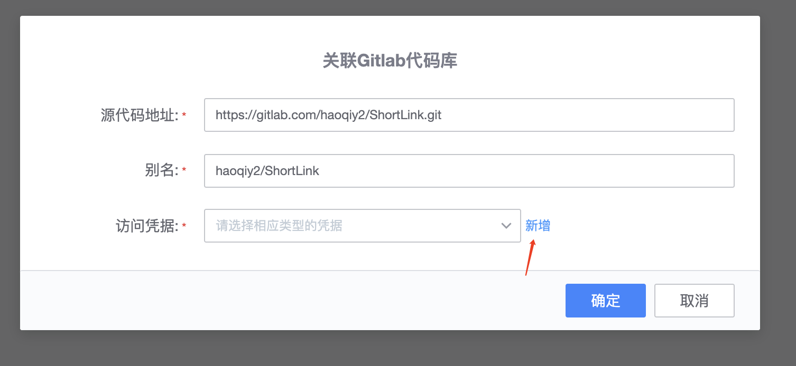
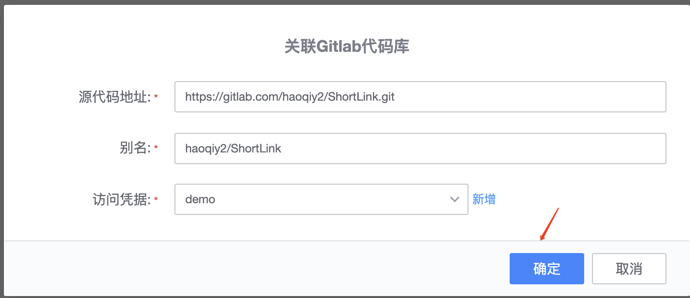
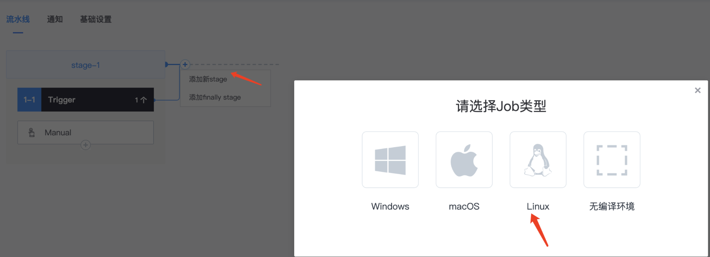
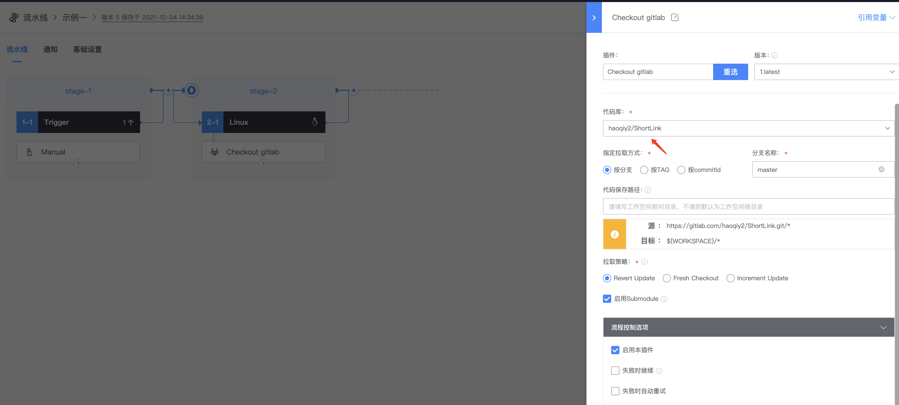
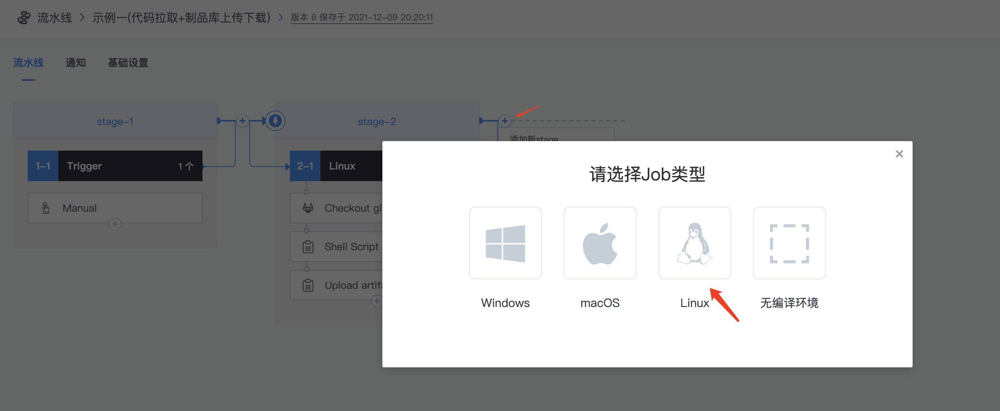
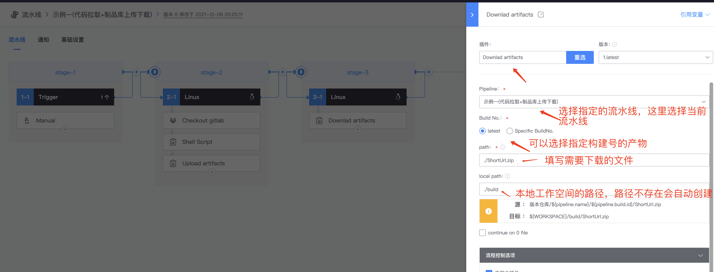

# 代码拉取+制品库上传下载

* 点击代码库，（代码库介绍详情见【代码库】目录）

* 选择关联Gitlab代码库

* 点击新增，会自动跳转到凭证管理--新增凭据，获取gitlab上的AccessToken进行填写，点击确定&#x20;

* 回到代码库，访问凭据上选择凭据【demo】，确定

* 创建流水线

添加新的stage

添加checkout gitlab插件，关联创建好的代码库，按分支拉取

添加shell插件，查看当前工作空间，以及拉取的代码目录，对代码进行打包

把当前工作空间的ShortUrl.zip文件保存下来放到制品库，可以使用upload artifacts插件

注：当在使用多种构建机类型的情况下(公共构建机+私有构建机或多个不同私有构建机)，不同构建机之间需要依赖使用构建产物时(不仅限于拉取的代码)，可以把文件/文件夹上传到制品库，在从需要使用到该文件的Job下，下载制品库对应的文件

* 添加upload artifacts插件

*   download artifacts插件---从制品库上下载文件到当前Job下的工作空间

    添加新stage

添加Download artifacts插件，会根据填写好的内容自动找到制品库的源路径，然后下载到当前工作空间

