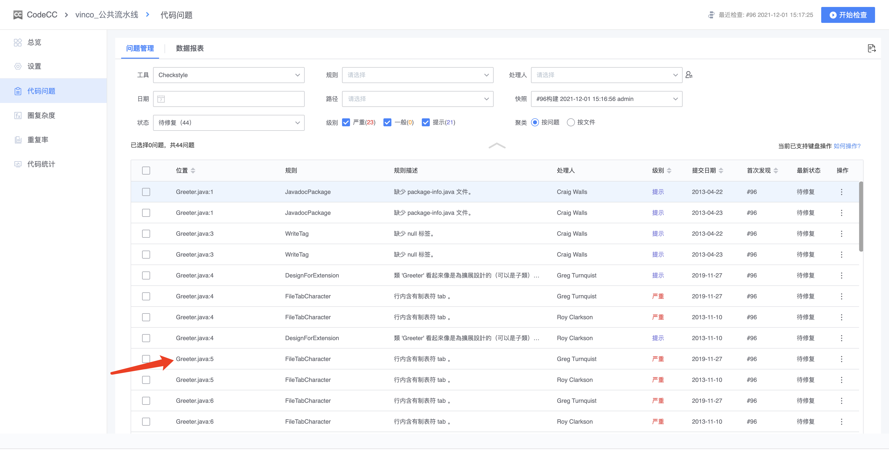
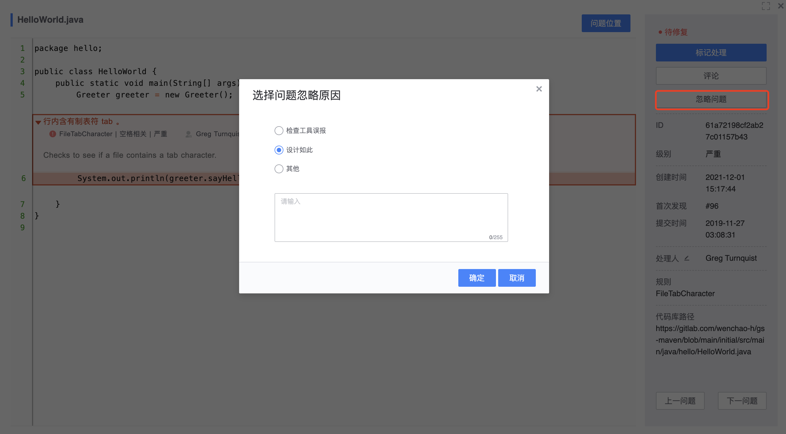

# 代码检查结果

点击流水线代码检查的结果数字，跳转到codecc详情页面，会展示具体的代码问题以及问题严重程度，点击「位置」可以定位到代码问题的具体位置

点击「问题位置」可快速定位有代码问题的具体位置，开发者手动处理代码问题，如已修复问题并提交到下一次commit，可以点击「标记处理」，如果下次的检查仍有问题，将会突出显示

如果该规则和开发者自身的设计不匹配，或者不符合开发者自身的代码风格，认为无需在意该问题的扫描，可以选择「忽略问题」；问题忽略后，将不会在待修复列表中出现

代码问题的「数据报表」功能，可以观察到多次代码检查结果的变化趋势

总览可以看到关于本次代码检查的统计结果

