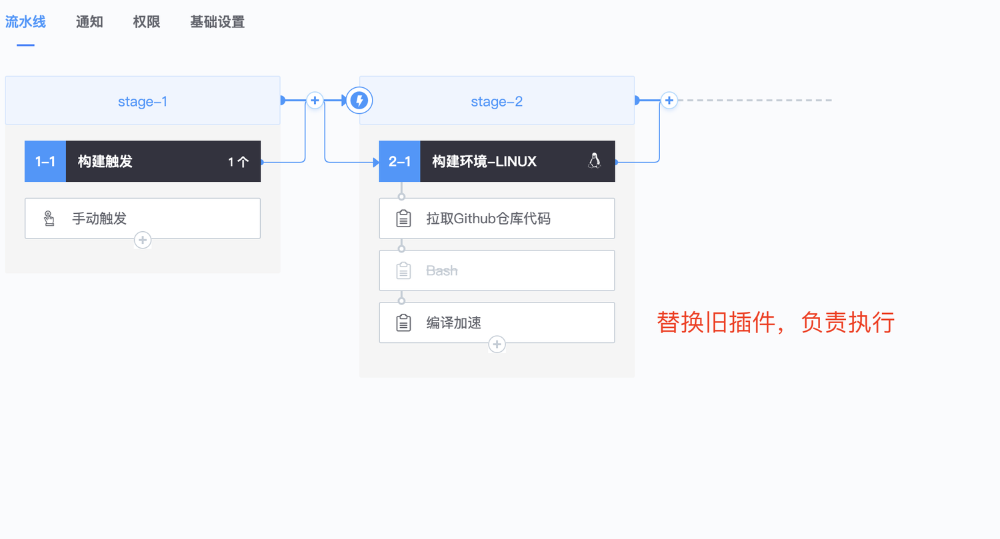
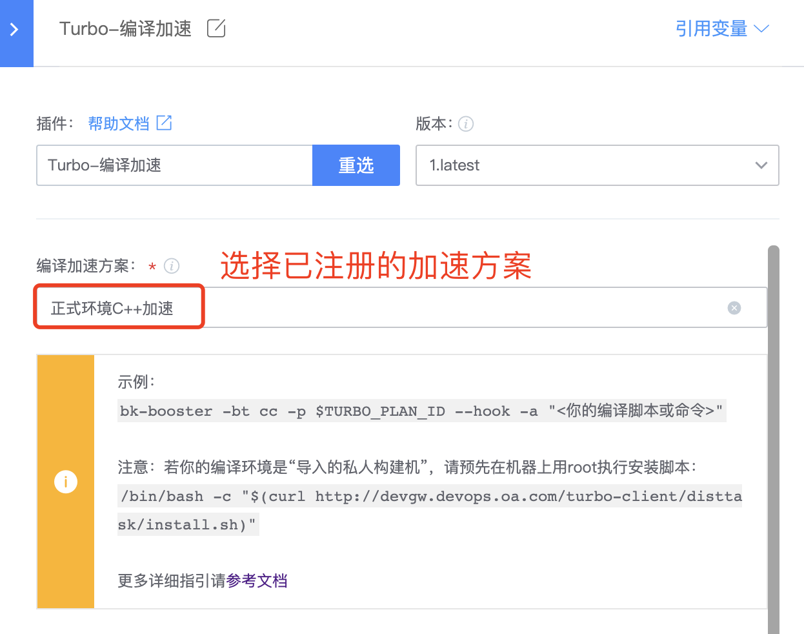
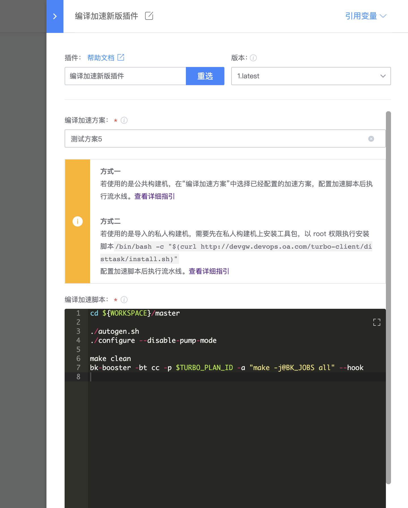

# 【Linux-C/C++加速】在蓝盾流水线中使用加速

## 准备工作
如果你的流水线所选择的环境是私有构建机，那么需要提前在你的机器上以root权限执行一下安装脚本

```bash
/bin/bash -c "$(curl http://xxxx/turbo-client/disttask/install.sh)"
```

如果你的流水线选择的是公共构建机，如“Docker On Devcloud“，则无需**这个步骤**。

### 1. 首先打开流水线，找到我们执行编译的“Bash”插件。
这是一个非常普通的make编译，我们要通过零侵入工程文件和环境，实现加速。


### 2. 在原来“Bash”插件的位置，添加一个“Turbo编译加速”插件。并把“Bash“插件的内容拷贝到新的插件里。
拷贝完成后，新的插件会负责执行编译，原来的“Bash”插件可以选择“不启用”或删除。




### 3. 在“Turbo编译加速”插件里，加速方案中，选择已经注册的方案。
注意加速方案中的“编译环境”配置，要与构建环境一致。



### 4. 修改插件中的脚本，启动加速。
原编译脚本为
```bash
cd ${WORKSPACE}/master

./autogen.sh
./configure --disable-pump-mode

make clean
make -j all
```

可见，前面部分的命令在做一些准备工作，实际编译指令是
```bash
make -j all
```
我们只需要修改这句，用加速器来执行编译指令，即可获得加速。
```
bk-booster -bt cc -p $TURBO_PLAN_ID --hook -a "make -j@BK_JOBS all"
```
其中bk-booster是插件提供的加速器，用来启动加速。

命令中的参数含义分别为

-bt cc，指定场景为cc，用于linux下的c/c++编译。
-p \$TURBO_PLAN_ID，指定方案ID，在“编译加速”插件中，会默认将第3步中选择的方案的ID，导入到环境变量$TURBO_PLAN_ID中。
--hook，开启命令hook，会自动劫持gcc/clang等编译器，实现加速。
-a "make -j@BK_JOBS all"，指定要执行的编译命令，其中@BK_JOBS作为占位符，在运行时会自动替换为推荐的并发数量。
修改后的脚本如图，保存之后再执行流水线，就可以**实现编译加速**了。




更多的脚本修改指引，如多层嵌套脚本、bazel编译等，请参照[详细文档]()。

### 5. 设置输出参数传递给下游步骤
在很多场景下，编译脚本需要输出一些变量，供下游步骤使用。在“Turbo编译加速插件中”，可以通过如下方式输出变量：
```bash
echo "::set-output name=<my_var>::<my_var_value>"
```
在下游插件的入参中，可以通过  ${{ my_var }} 的方式引用变量

