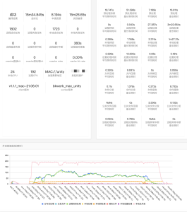

# 2021-06-24 全新版本发布

Turbo 编译加速升级啦，本次更新主要内容有：

**1. 新版本使用全新的自研分布式加速引擎，功能更强大，编译速度更快**
[了解新引擎]()

**2. 新增对 UE4 多平台编译加速的支持：**
包括不限于

- Editor编译加速
- Shader编译加速 
- Dedicated Servers编译加速 

项目组接入实测数据，windows下客户端速度提升： 2-3倍，mac下客户端速度提升： 3-5倍

[查看接入指引]()

**3. 使用新的 “Linux-C/C++加速” 模式替代旧的 Distcc+ccache 加速：**
新模式使用自研引擎，可提供更多的编译过程数据
无需再修改cmake或者bazel toolchain，一行脚本即可轻松启用
[【推荐】Linux-C/C++加速方案]()

**4. 使用新引擎，编译过程可视化，可以协助业务快速找到编译瓶颈**
编译过程数据示例：

实例参考：[TBS分布式编译加速案例合集]()

**5. 一个加速方案，多实例使用：**
无需重复配置加速任务。定制一个加速方案后，项目下的成员可以复用。

**6. 流水线中，通过新插件【Turbo-编译加速】来使用新的服务**

- 和 Bash 插件解耦，编译加速任务不再和流水线节点强绑定
- 支持通过 echo " ::set-output name=<my_var_1>::<my_var_value_1>" 的方式设置输出变量

注：

升级后，不影响旧版编译加速任务执行。系统自动将旧的编译任务，生成对应的加速方案，可以在新版编译加速服务下查看执行历史。但不再支持通过 Bash 插件创建新的实例。建议大家尽快迁移到新版，可以查看更详细的编译过程数据，以后功能迭代也将在新版本之上进行。

