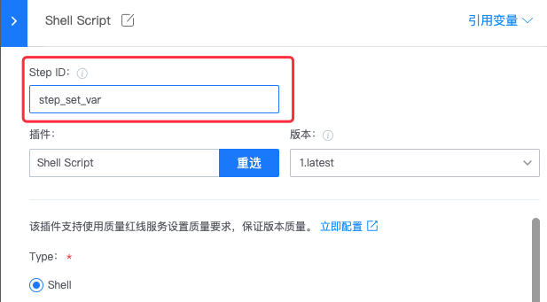
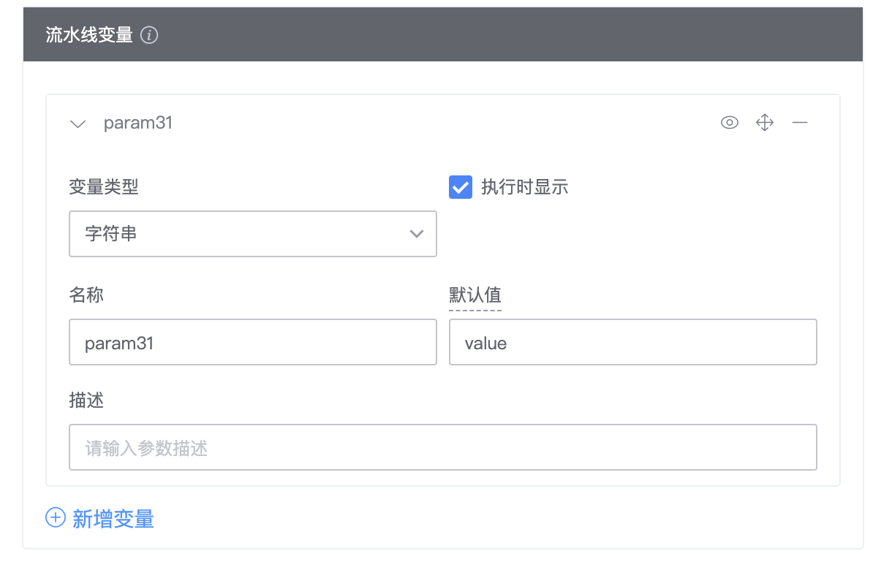

# Variables

## 在流水线中定义变量

### 在编排流水线时自定义变量

在编辑流水线页面点击 Job1-1，可以添加流水线变量。


### 在流水线插件中设置变量

如果你在 bk-ci 中开发了自己的流水线插件，可以在插件的 task.json 中定义 output 字段，这样也可以在运行该插件时声明这些变量。

### 通过 Bash 插件设置变量

#### (推荐)使用`set-variable`方式

您可以通过 Shell Script 插件中的 特定的语法`echo "::set-variable name=<var_name>::<value>"`设置插件间传递的参数，用法如下：

```bash
#!/usr/bin/env bash
# echo "::set-variable name=<var_name>::<value>"
# eg:
# echo "::set-variable name=fooBarVarName:fooBarVarValue"
```


- set-variable 设置的也是**全局变量**，如果两个Bash并发设置同名变量，设置结果也不可预期（但不会受其他插件输出的影响）

通过此方法设置的变量，在下游通过表达式引用：${{ variables.fooBarVarName }}

- 在 stage/job/task的流程控制条件中引用时，也是通过 variables.b来引用，如：


#### (推荐)使用`set-outputs`方式

您可以通过 Shell Script 插件中的 特定的语法`echo "::set-output name=<output_name>::<value>"`设置插件间传递的参数，用法如下：

```bash
#!/usr/bin/env bash
# echo "::set-output name=<output_name>::<value>"
# eg:
# echo "::set-output name=outputVarName:outputVarValue"
```

通过此方法设置的输出变量，不会被任何步骤的同名输出覆盖。

使用此方法时，需设置对应步骤的id：



用于下游步骤引用此变量：

- 当在 job2 中访问前置的 job1 的 step_set_var 的输出 outputVarName 时：${{ jobs.job1.steps.step_set_var.outputs.outputVarName }}
- 当在 job2 中访问当前 job 下的 step_set_var 的输出 outputVarName 时，无需加 jobs 上下文，直接通过 steps 引用：${{ steps.step_set_var.outputs.outputVarName }}
- 在 stage/job/task的流程控制条件中引用时，变量名也需配置为 jobs.job1.steps.step_set_var.outputs.outputVarName 的格式

job id 在 job 配置上管理：（系统设置了一个默认值，可以修改为自己想要的id。需保证流水线下唯一）


#### (不推荐)使用`setEnv`函数

您可以通过 Shell Script 插件中的 setEnv 函数设置插件间传递的参数，用法如下：

```bash
#!/usr/bin/env bash
# setEnv "FILENAME" "package.zip"
# 然后在后续的插件的表单中使用${{FILENAME}}引用这个变量
```


## 在流水线中引用变量

你可以在任意的插件表单中使用通过上面介绍的方式定义的变量，引用方式为 ${{variables.<var_name>}}或${{KEY}}，例如：


> 示例中，就在“Upload artifacts”插件中的某字段中引用了 ${{variables.fooBarVarName}} 这个变量。

## 在手动触发流水线时设置变量值

1. 在编辑流水线时定义了流水线变量，并开启了“执行时显示”选项时，则会在运行流水线后进入**流水线预览页**；



2. 进入预览页，你可以再次编辑你的变量 value 并运行流水线。


> 变量 Key 在执行时不可修改，只能修改 value。

## 接下来你可能需要

- [预定义变量列表](../FAQS/Variables.md)
