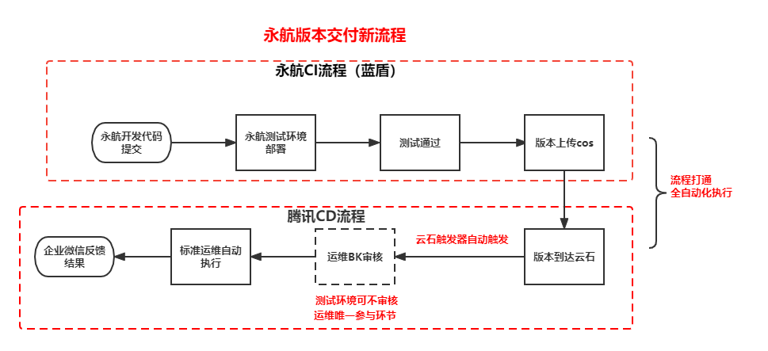

# **永航--通过蓝鲸BKCI实现跨环境CICD互通**

 

||
|:-|
|**涉及产品：** BKCI流水线；蓝鲸标准运维|
|**场景标签：** 跨网络环境的CICD打通；编译自动化|
|**解决的问题：**  自动化程度低；版本错更、漏更|

腾讯旗下的永航科技有限公司是一家位于北京的游戏研发公司。自2008年起，永航相继在腾讯游戏平台推出《QQ炫舞》、《QQ炫舞2》、《QQ炫舞手游》等深受玩家喜爱的游戏产品。其中《QQ炫舞》端游是腾讯“四大名著”之一的六星级重要业务，版本迭代快，玩法不断推陈出新，且至今仍保持营收的逐年增长。

在过往永航的CI/CD流程中，自动化程度低、依赖人工沟通、操作干预，从而导致人工干预的时效性以及准确性，成为了出包、发布过程中的决定性因素。

通过使用蓝鲸BKCI工具，永航实现了CI/CD流程的如下效率提升：
1. 针对CI过程中耗时长的步骤进行了分析定位，并完成了一系列自动化流水线的搭建，将“版本自动打包”，“版本自动上传”，“内部开发环境一键部署”、“自动通知”等流程自动化，**释放永航开发人员在CI过程中约3开发人力。**
2. 通过云石触发器串联起永航与正式发布环境之间的隔阂，**通过操作自动化、降低沟通成本，使得跨环境部署流程耗时缩短84%，同时也完全避免发布阶段错更以及漏更的发生。**

对于BKCI所以实现的效率提升，永航的游戏开发说道：“BKCI把多个业务多版本整合到了一个统一的系统，测试/美术/策划都能参与进来执行各自的部署环节， 减少了跨部分沟通障碍，以往版本发送至腾讯云石ftp之后需要在邮件、企业微信各大群通知腾讯运维、测试同学部署相应版本，现在通过BKCI流水线可以由内部测试同学通过BKCI流水线直接更新腾讯测试环境，并直接反馈结果到我们这里，通过云石触发器联动腾讯内部CD流程大大减少了沟通、等待时间，尤其是在周末紧急版本情况下，提高了整个项目版本部署的效率。”

永航通过蓝鲸BKCI打通了CI/CD的全流程，实现了从CI到CD的全面自动化。多款永航业务都已完成蓝鲸、BKCI的接入，就永航反馈来看，效果显著，节省了永航从开发到发布流程中涉及美术、前后端开发、测试、运维等不同职能同学的人力投入。目前，永航正在对编译加速、代码检查等场景进行更深度的探索，从发现、修复代码缺陷以及提升编译速度的维度继续加深对于BKCI的使用。
