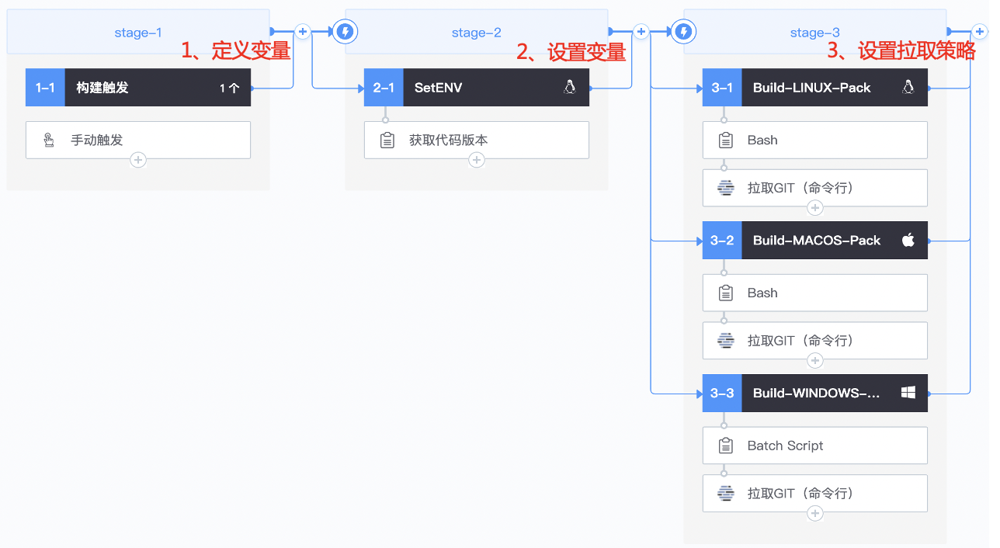
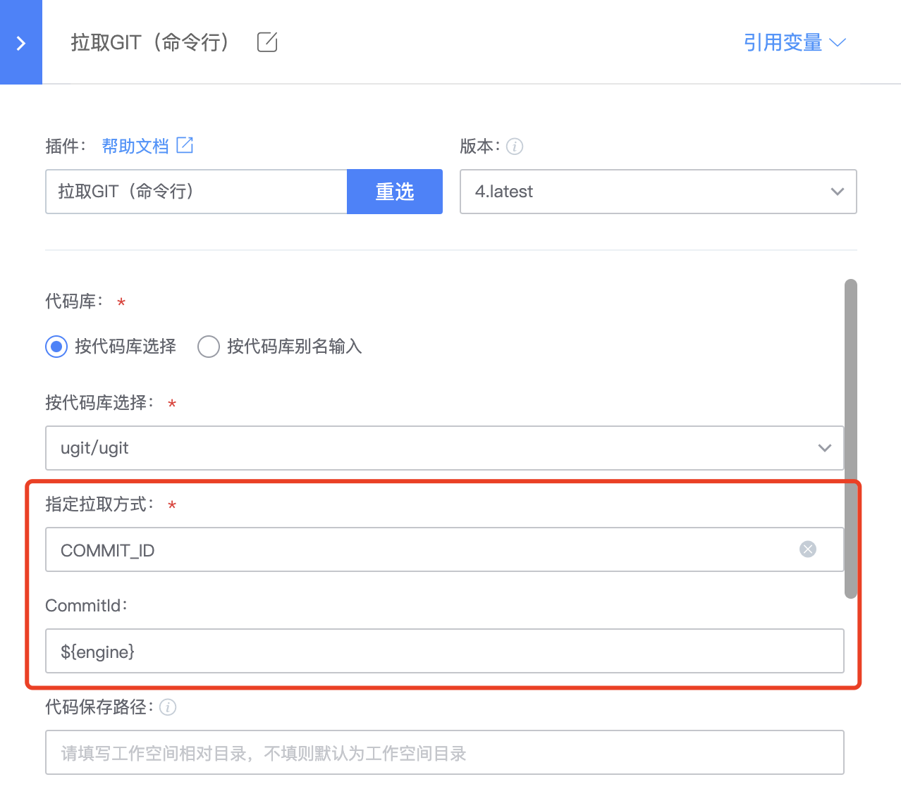

# 客户端多版本构建保持一致

## 关键词：多版本、一致性

## 业务挑战

构建客户端时，可能涉及多个代码仓库，或在多种构建环境上构建不同版本（如Linux、Windows、MacOS等）的情况。在不同的系统上拉取同一个代码库时，可能因为时差而导致拉取的代码版本不一致。为解决这个问题，每次构建需要将所涉及的多个仓库的commit信息记录在文件中以便后面回溯使用；但当发现问题时，就不得不返工，大大影响研发效率；

## BKCI优势

BKCI流水线能够设置公共的环境变量，以确保不同的Job（环境）拉取相同版本的代码从而将多版本构建异常率降为0。

## 解决方案

步骤1:开发人员配置流水线，重点在定义&设置环境变量、设置代码拉取策略

定义环境变量，假设我们构建涉及engine、content和client三个仓库，那么我们设置三个环境变量来对应三个仓库。

通过环境变量设置拉取代码策略，这里使用前面设置的环境变量来拉取指定版本代码信息

步骤2:填写流水线执行参数，点击“执行”；等待执行完成。

