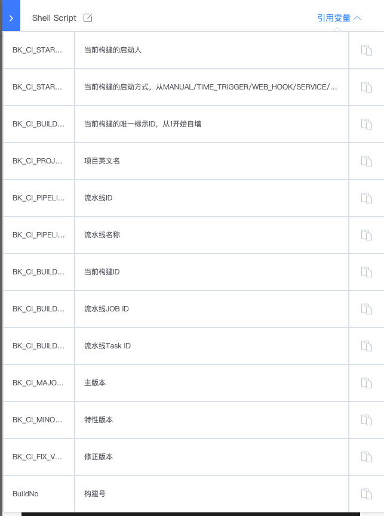

# 流水线变量

在流水线中，用户可以使用系统常量/变量，或者自定义变量来完成构建任务或者控制流水线的流程。

## 系统常量/变量

系统常量/变量一般以 BK_CI_ 开头，通过 `${{变量名称}}` 的方式引用。可在大部分的流水线插件输入参数中引用。

一些常用的系统常量/变量可以在流水线插件编辑页面右上角「引用变量」获取，如下图所示：

完整的系统常量/变量可以查看：

-  [预定义常量/变量](../../../../intro/terminology/pre-define-var/README.md)

## 自定义变量

- [自定义流水线变量](./variables-custom.md)
- [在流水线中引用变量](./variables-custom-use.md)

## 还可以查阅一下更多变量用法：

- [变量的基本使用](./pipeline-variables-shell-batch.md)
 
- [使用变量控制流水线流程](./pipeline-variables-flow-control.md)

- [凭证变量](./pipeline-variables-ticket.md)

- [使用备注变量](./pipeline-variables-remark.md)

