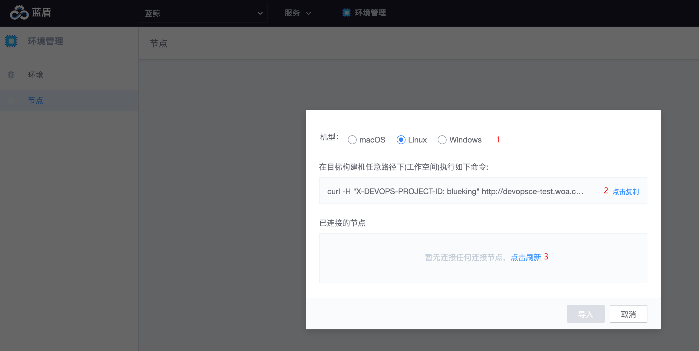

# 将你的构建机托管至 BKCI

除了使用 BKCI 内置的公共构建资源运行流水线，还可以将自己的构建资源以私有构建机的形式托管至 BKCI，构建资源支持 macOS、Windows、Linux。
> 托管前，请先准备好执行环境：[私有构建机环境准备](prepara-agent.md)

导入方法：服务-环境管理-节点页面，点击右上角的导入私有构建机：

根据弹窗：

1. 选择机器的系统，不同操作系统安装命令和安装方法不一样（windows可参考[导入windows构建机](self-hosted-agents/windows-agent.md)）；
2. 复制安装 Agent 的命令，在你的构建机的目标工作空间中执行该命令，进行 Agent 的下载和安装
3. 安装完 Agent 以后，点击刷新，刷新出节点，点击导入即可。

## 接下来你可能需要

- [构建机详情页](./agent-detail.md)
