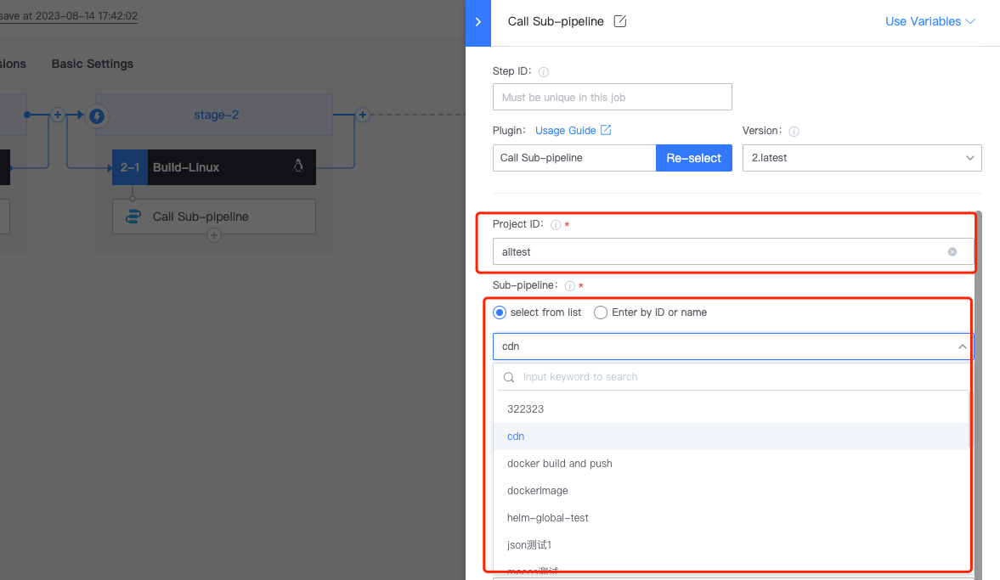
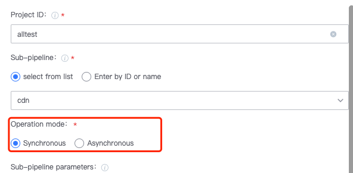
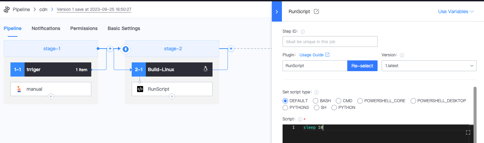

 # subPipeline 

 subPipeline: You can call other pipelines under the current pipeline 

 * add Stage 

  

 * select call pipeline Plugin. Here, the subPipeline be called “cdn" and belong to project "alltest". At the same time, it is divided into synchronous and asynchronous call execute. Fill In the var parameters of the sub-pipeline. 

  

  

 * append runscript Plugin, sleep for 20s 

  

 * subPipeline demo, execute the Operation of sleep 10 

  

 * execute Pipeline. The call pipeline will Success Immediately after calling the subPipeline, and then execute the next Operation. At this time, the sub-pipeline demo will be executed asynchronously (in the case of synchronization, it will wait for the Pipeline runs complete the execution before executing the next One) 

  

  