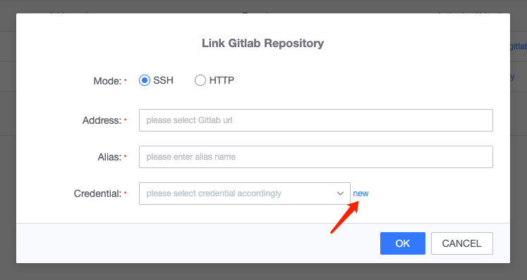
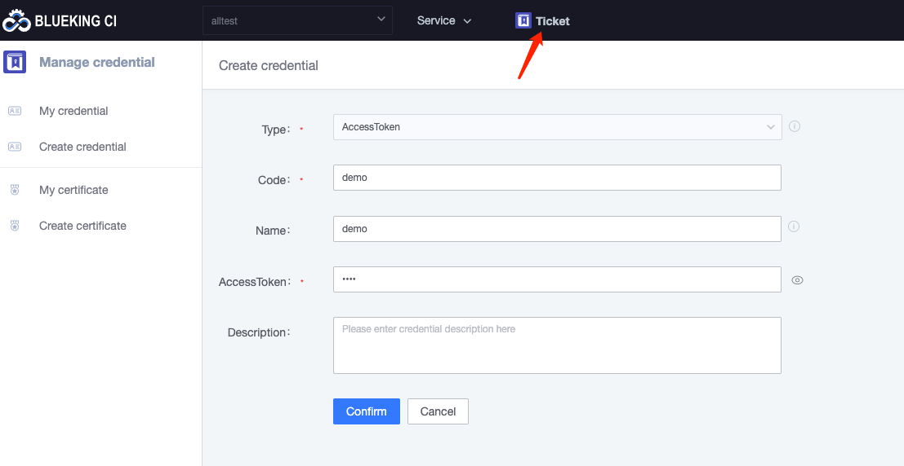
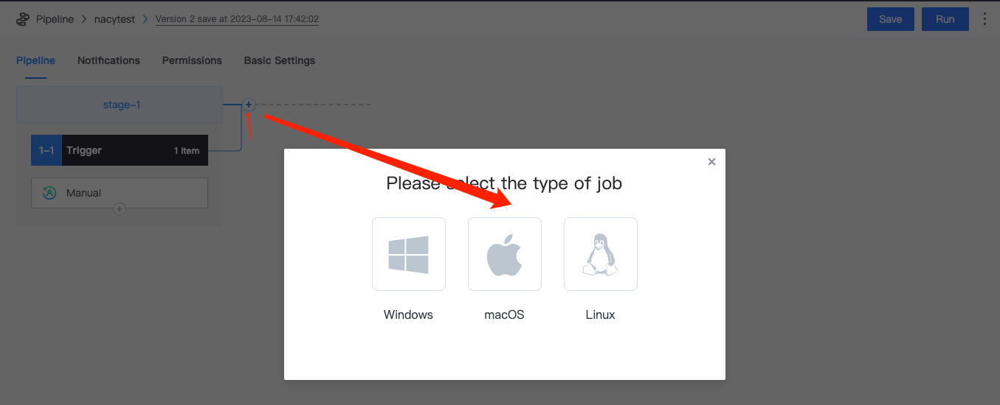
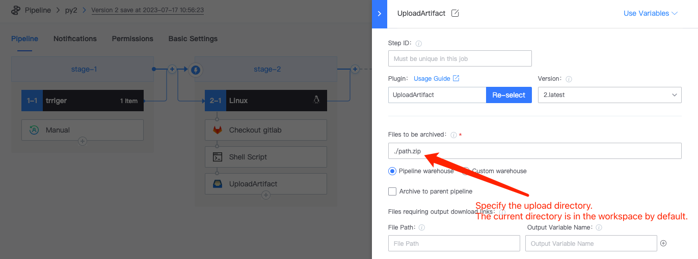

 # Code Pull + BK-Repo upload download 

 * click the Code Repository (for detail of the code base, see the [Code Base] directory). 

  

 * select the link Gitlab Code Repository 

  

 * click new to auto location to credentialManage--addCredential, obtain accessToken on gitlab to Fill In, and click determine&#x20; 

  

 * Go back to the Code Repository, select "demo" as the codelibCredential, and determine 

  

 * createPipeline 

  

 append a new stage 

  

 append checkout gitlab Plugin, link OK create Code Repository, and Pull branchLabel 

  

 append RunScript Plugin, view the current workspace and the Pull Code directory, and package the code 

  

 save the ShortUrl.zip file of the current workspace to the BK-Repo, you can use the upload artifacts Plugin 

 Note: In the case of using multiple agent type (BK-CI hosted agent + Self hosted agent or multiple different private builders), when different builders need to rely on the use of building products (not limited to the Pull Code), you can upload the file/folder to the BK-Repo, and download the file corresponding to the artifact library from the Job that needs to use The file. 

 * append upload artifacts Plugin 

  

 *   download artifacts Plugin---download file from the BK-Repo to the workspace under the current Job 

    insertStage 

  

 append the Download artifacts Plugin, which will auto find the source path of the BK-Repo according to OK Fill In content, and then download it to the current workspace 

  