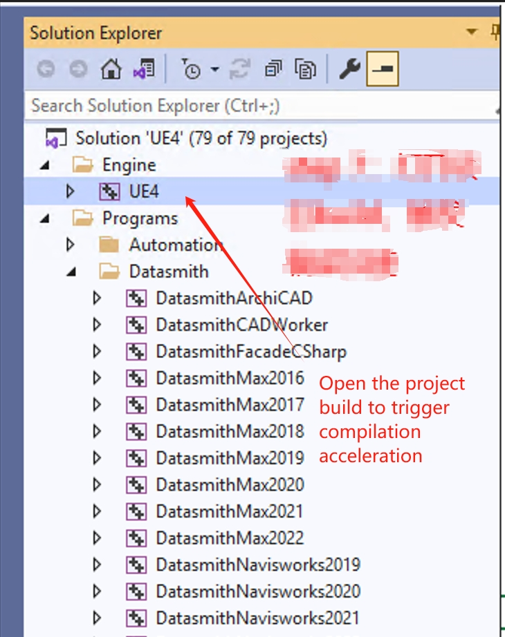

 # UE4 engine Turbo 

 ## Keywords: UE engine, Turbo 

 ## Business Name Challenges 

 For project Develop based on UE4 game engine, a large amount of resources (CPU/Memory/Disk) will be consumed in the Code compilation/shader compilation of the project. It takes dozens of minutes or even hours to do One All, which danger affects the R & D Efficiency. 

 ## Advantages of BK-CI 

 BK-CI Apply the TBS (general Task Acceleration system) system to some Scene of UE4, and executes local tasks that can be execute in parallel by using distributed resources to achieve overall acceleration 

 ## Solution 

  

  

  

  

  

  