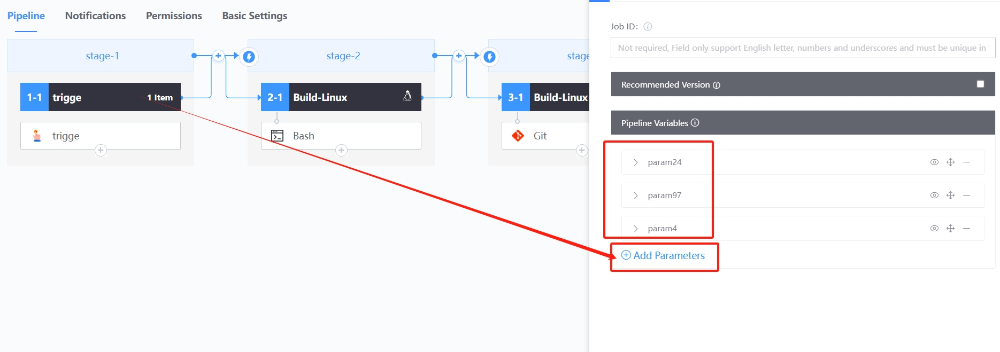
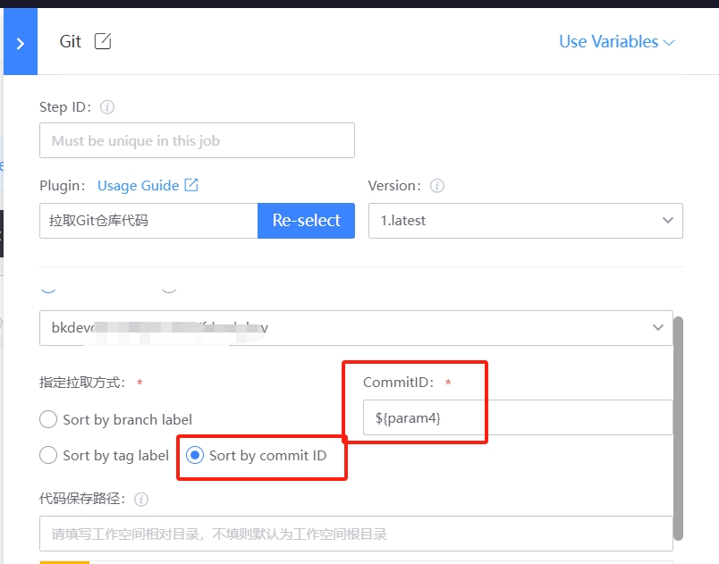

 # Client version build are consistent 

 ## Keywords: version, Consistency 

 ## Business Name Challenges 

 When build a client, it may involve multiple Code repositories or situations where different version are built on multiple buildEnvType (such as Linux, Windows, MacOS, and so on).  When Pull the same Code Repository on different system, the code version pulled may be inconsistent due to time difference.  To solve this problem, each build needs to record the commit information of the multiple repositories involved in the file for later Rehydrate use; However, when problems are found, they have to rework, which greatly affects the Efficiency of research and development. 

 ## Advantages of BK-CI 

 The BK-CI Pipeline can Set common Env Variables to ensure that different jobs (environments) Pull the same version of the Code to reduce the multi-version build abnormal rate to zero. 

 ## Solution 

 Step 1: The Develop configPipeline, focusing on definition & Set Env Variables and setting Code Pull Alert Rules 

  

 definition Env Variables. Suppose we build Three repositories involving engine, content and client, then we Set three environment variables to correspond to the three repositories. 

  

 Set the Code pulling Alert Rules approve the Env Variables. The environment variable set above is used to pull the specified version code information. 

  

 Step 2: Fill In Pipeline runs Parameter, and click "Execute"; Waiting for execution to complete. 

  