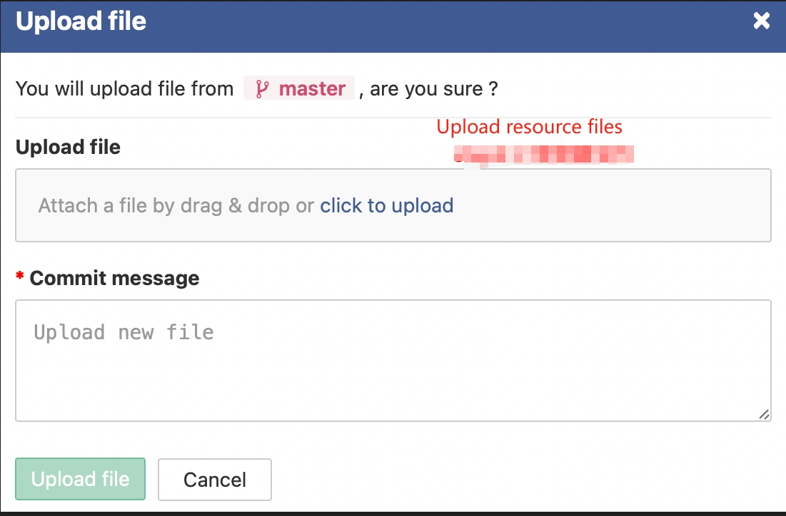
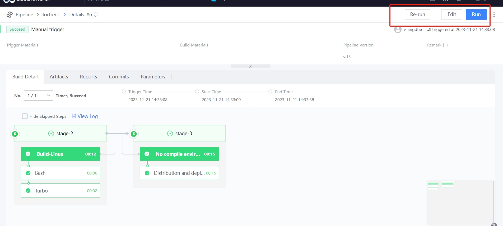

 # Operators Release in-game operations activities 

 ## Keywords: Game Operation, Event Release 

 ## Business Name Challenges 

 In the game operation Stage, there are often some short Develop cycles and low workload (such as: The content of One operation activity needs to be Release to the existing network.  The work involves engineers Replace the assets in the client engine, Revise the setting file in the Code, and then build a new resources package, which is then configured for Release. 

 ## Advantages of BK-CI 

 With the visual interface of BK-CI Pipeline, game operators can setting and Revise materials by themselves, and complete the work of packaging build, configuration Release.  Only One person can complete the Release of an operation activity in a few hours. 

 ## Solution 

 First of all, Develop help game operations configPipeline, which can be divided into Three Stage: Pipeline triggering, compiling and build, distribution Deploy 

  

 Game operators upload art materials and setting file to the version library approve GIT 

  

 The game operator opens BK-CI, click "execute", and Waiting for execution to end 

  