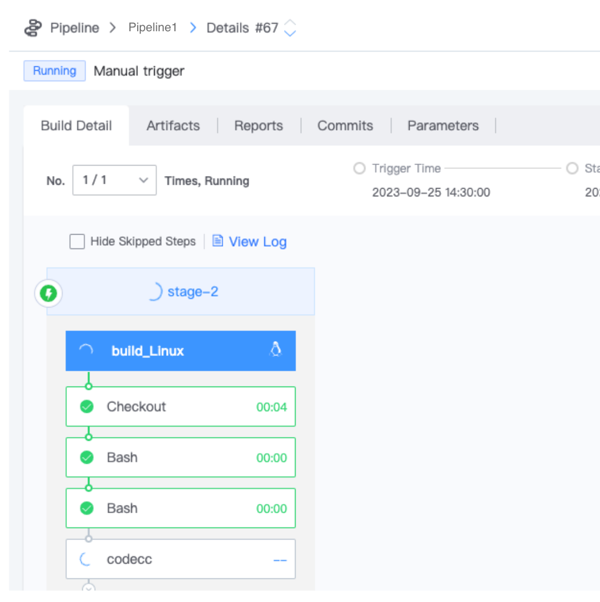

 # Create your One Pipeline 

 This step-by-step tutorial create One Pipeline for your Go project. 

 ## Preparations 

 - One git project, see [link your first Code Repository](Link-your-first-repo.md) 
 - One BK-CI project 
 - Familiar with [edit Pipeline](../Services/Pipeline/pipeline-edit-guide/pipeline-edit.md) 

 ## Run your One build 

 1. Open BK-CI and switch to Pipeline service 
 2. Switch to your project 
 3. click addPipeline 
 4. edit the Pipeline as shown in the following figure: 
    
 5. click **saveAndExec** 
 6. Your #1 build has Run Success, please wait for it to finish 
    

 ## Next you may need 

 You may need to take One step further to understand Pipeline: 

 - [5 minutes read BK-CI Pipeline](../intro/terminology/Learn-pipeline-in-5min.md) 