 # Getting Started with BlueKing The document 

 ## 1. create One user 
 Add, delete, change and check the user information related to the BlueKing environment can be Operation in "userManage".  As shown below: 

 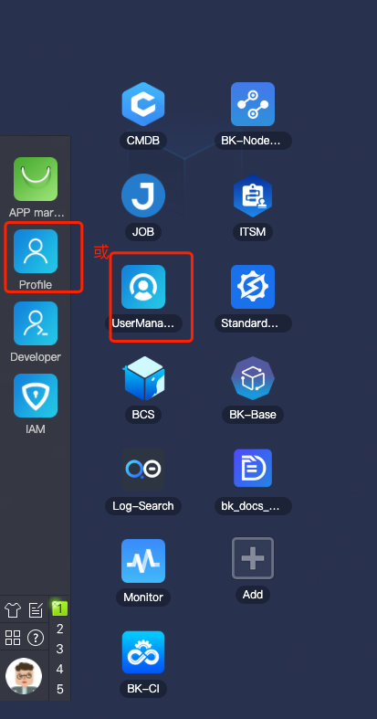 

 ### 1.1 append user 
  

  

 ### 1.2 Revise user Information 

  

 Related learning materials: 
 - The document: https://bk.tencent.com/docs/document/6.0/146/7330 (The document is the community version, and the functions are basically the same as those of the enterprise version) 

 - Video: ke.qq.com/course/3101748?  taid=10600778153546804 

 ## 2. create One Business Name 

 Enter the "Configuration System", where you can Manage "Business Name-Host 

  

 ### 2.1 create a Business Name 

  

 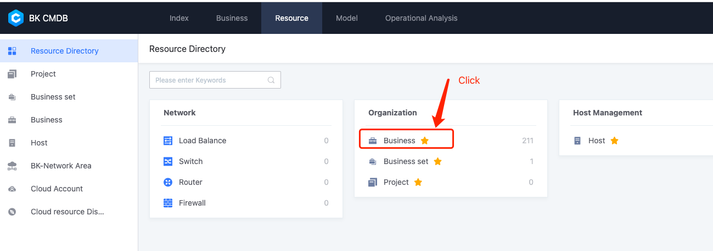 

 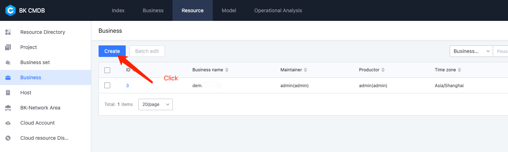 

 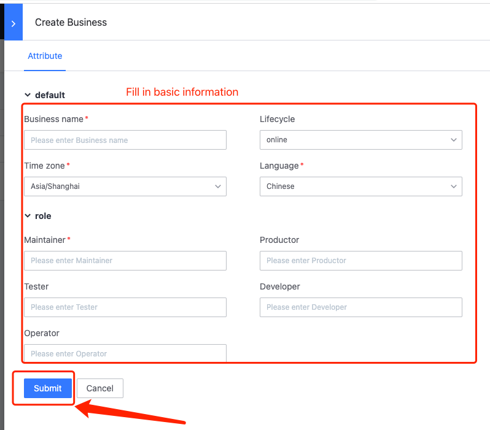 

 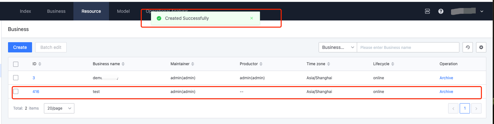 

 ### 2.2 view Business Name module and Host 

  

  

 If you do not see the newly create Business Name, click "reflash Apply" in the lower left corner of the page, and then repeat "Step 2" and "Step 3" 
 Then we see the information about the Business Name we just create. 

  

 ## 3. create One auth group to link the Operation permissions of user and Business Name in the platform 

 Here, the admin account is required to append auth to the Business Name. To facilitate subsequent Operation related to The business, it is recommended to use "create Permission Group" and then link "user" to "Permission Group". 

  

 ### 3.1 create One Business Name auth Configuration System Template 

  

 After switching identities, Enter the Super Administrator mode. Only the Super Admin can create a Business Name Permission Group with a high Permission Level. 

  

  

 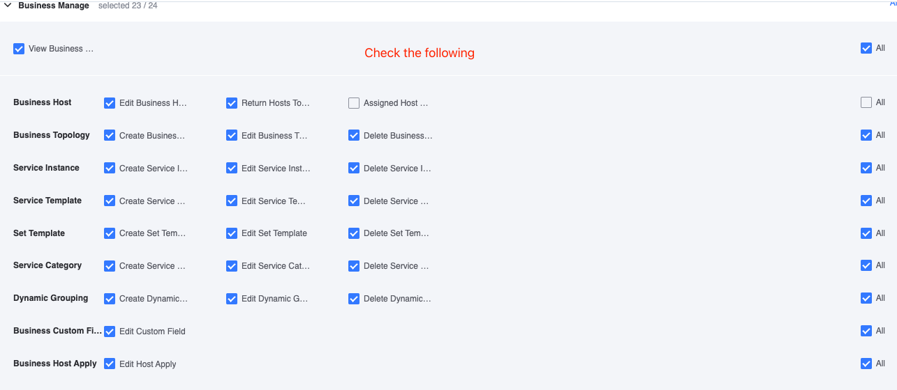 

 The corresponding Role (such as: OPS, Develop) Recommended Default setting "version, the current version needs to be checked manual 
 Then associate the corresponding "resources instance" for the "auth" just select 

  

  

  

  

  

  

 ### 3.2 create One Business Name auth Group

  

 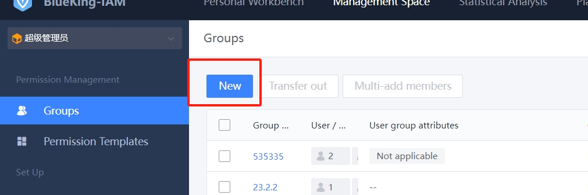 

  

  

  

 ## 4. append One host for Business Name 

 Enter the Home and click "NodeMan". 

  

 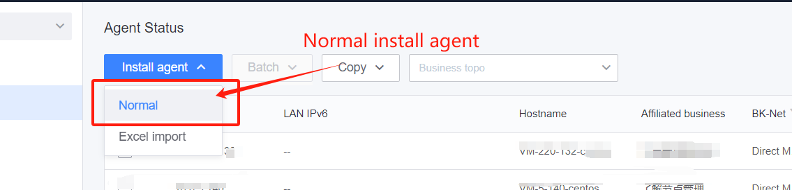 

  

  

 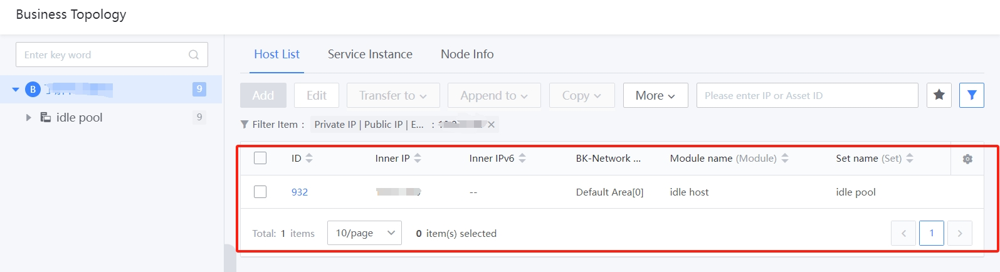 

 ## 5. Manage Host in Configuration System

 Next, we will Deploy One service called "dataserver" on the newly added Host.  To facilitate subsequent Manage, we first create some information on the Configuration System. 

 ### 5.1 create One set (cluster) and module (module)

  

 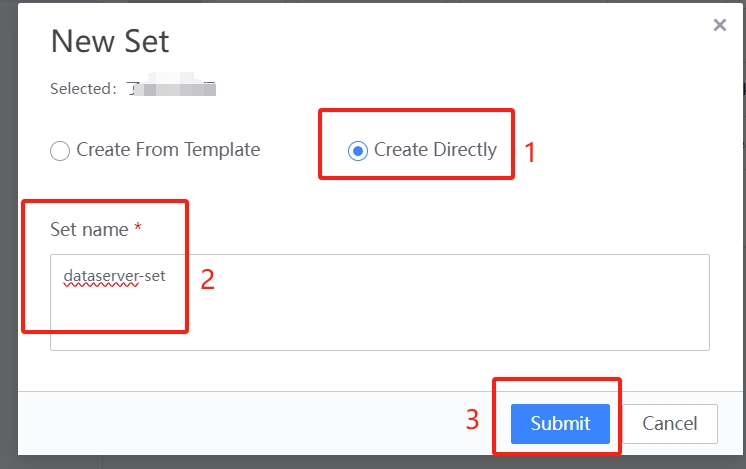 

  

  

 ### 5.2 Move Host to module and Revise CVM Information 

 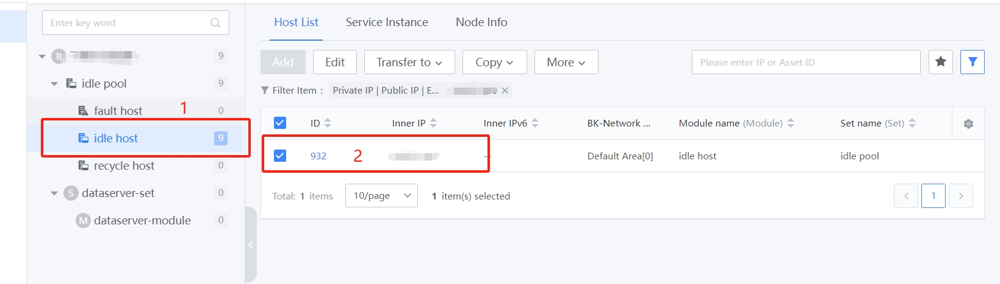 

 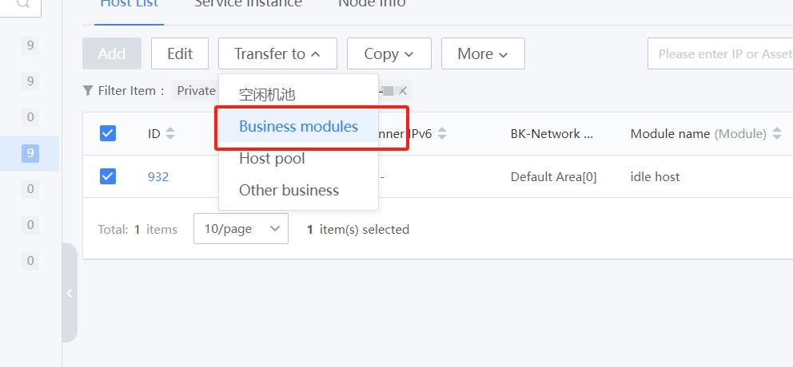 

 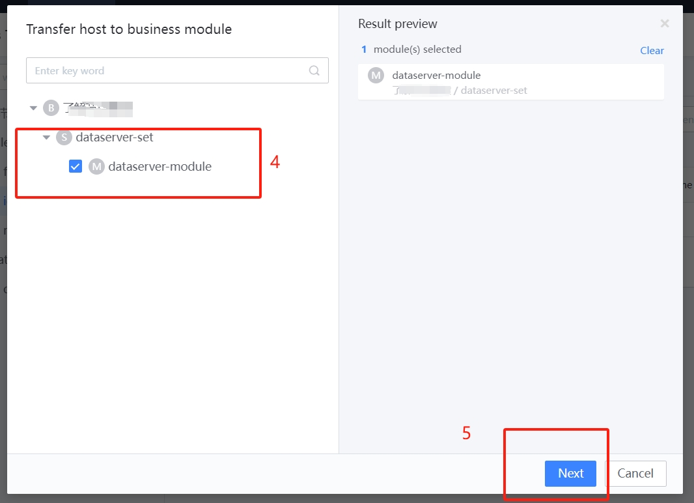 

  

  

  

 ## 6. Deploy the dataserver service using the Job System 

  

 ### 6.1 upload Local file to Host 

 https://www.python.org/ftp/python/3.9.4/Python-3.9.4.tgz 

  

  

 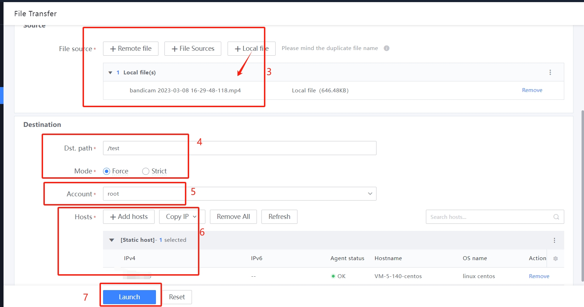 

  

 ### 6.2 Deploy service with Script execute 

  

  

    
    cd /data 
    yum install -y gcc python39-devel bzip2-devel sqlite-devel openssl-devel readline-devel xz-devel tk-devel gdbm-devel 

    mkdir -p /data/corefile 
    chmod 777 /data/corefile 
    echo 'ulimit -c unlimited' >> /etc/profile 
    sed -i "/^kernel.core_pattern =/d" /etc/sysctl.conf 
    echo 'kernel.core_pattern = /data/corefile/core_%e_%t' >> /etc/sysctl.conf 
    sysctl -p /etc/sysctl.conf 

    tar zxvf Python-3.9.4.tgz 
    cd Python-3.9.4 
    ./  configure 
    make && make install 
    make clean && make distclean 

    mkdir -p /data/app 
    pip3 install Flask 
    pip3 freeze > /data/app/requirements.txt 
    cat > /data/app/app.py <<EOF 
    from flask import Flask 
    app = Flask(__name__) 

    @app.route('/') 
    def hello_world(): 
        return 'Hello, World' 
    EOF 

    cd /data/app 
    nohup python3 -m flask run >/dev/null 2>&1 & 

 ## 7. Monitor Host and processes using the Monitor 

 ### 7.1 Information about create a process in "Configuration System"

 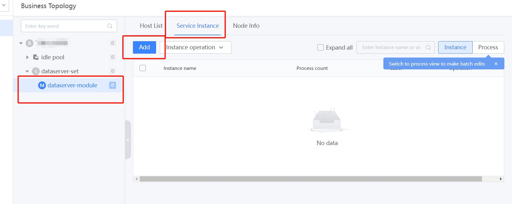 

  

 ### 7.2 Monitor setting Alert 
  

  

 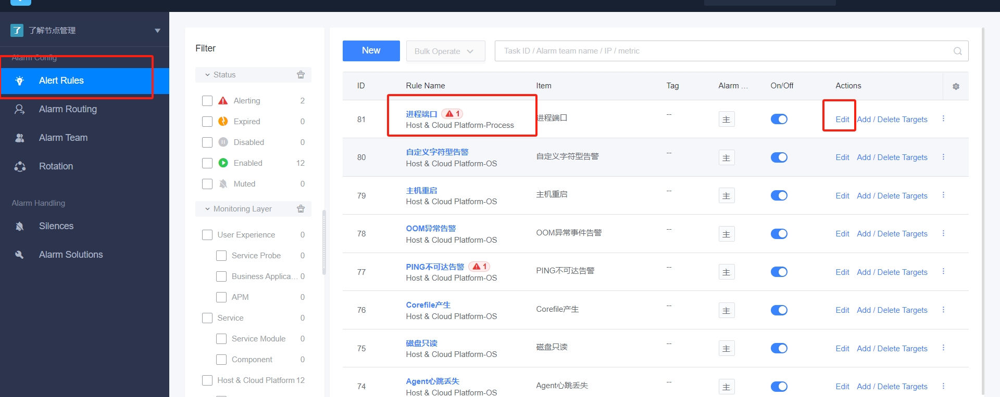 

  

  

