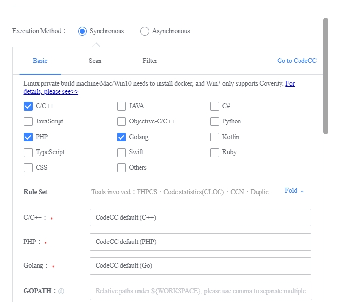
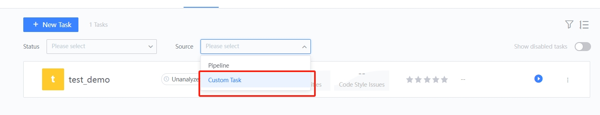
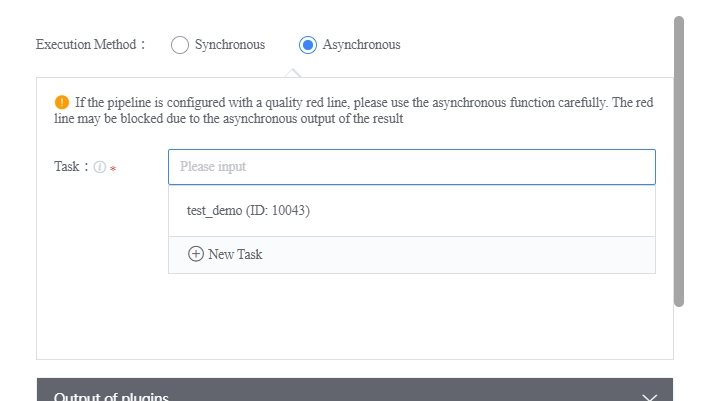

 # Code Analysis Setting 

 ## Execute Method 
 The plugin execution mode is divided into synchronous and asynchronous modes. In synchronous mode, you create a code analysis task while using the plugin.  In the asynchronous mode, you must first create a code inspection task of the type "Self-Created Task" on the Code Analysis page, and then select the corresponding task in the pipeline. 
 **Synchronous execution method:** 

  

  

 **Asynchronous execution mode:** 

  

  

 It is recommended that users use **run synchronization**. 

 ## Scan Settings 
 **Increment the scan:** Scan the difference code between the current build and the previous build.  First full scan. 
 **MR Scan:** Scan the difference code between the source branch and the target branch of MR/PR.  The source branch code must be pulled into the workspace. 
 **Full scan:** Scan all code.  Klocwork, Pinpoint, Gometalinter and Duplications only support the scan mode. 

 ## Path Shield 
 Path Shield is divided into "path whiteList" and "path blacklist". 
 **Path whiteList:** Once set, code analysis will only scan files in whitelisted paths. Wildcards are supported. 
 Take the absolute path `/data/landun/workspace/CodeCTest/cpp/` as an example: 
 1. Enter `/CodeCCTest/cpp/` to scan the relative path, only `/cpp/` will have no effect. To scan a specific type of file, such as `*.pb.cc` generated by protobuffer, you can type `.*/.*\. pb\.cc`; 
 2. To scan a file in the workspace, such as P2PLive, type `.*/ P2PLive/.* `; 
 3. To scan only a specific type of file under a specific file, such as `*.c` under P2PLive. You can type `.*/ P2PLive/.*\.c`; 
 4. If multiple paths are entered on one line or path match, they can be separated by English commas; 
 5. Support pipelineVar 
   
 **Path blacklist:** Code analysis does not scan all files under the path. Wildcards are supported. 
 1. Protect certain file, such as `*.pb.cc` generated by protobuffer, you can enter `.*/.*\. pb\.cc`; 
 2. Block a file in all branches, such as P2PLive, by typing `.*/ P2PLive/.* `; 
 3. Shield a file of a certain type under a file, such as `*.c` under P2PLive. You can type `.*/ P2PLive/.*\.c`; 
 4. If multiple path matches are entered on one line, they can be separated by commas; 
 5. Support pipelineVar 