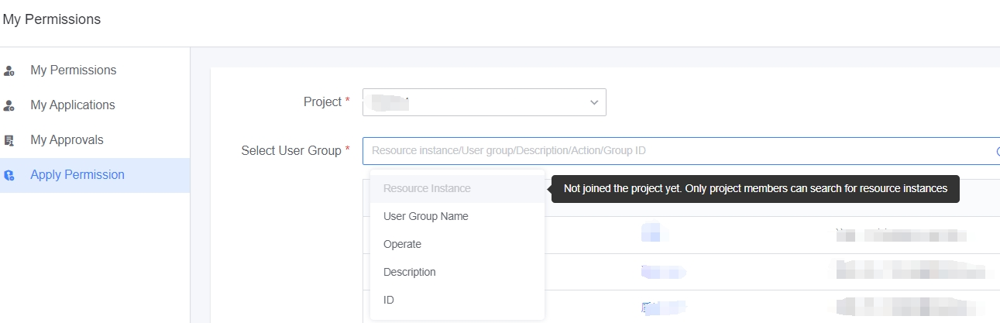
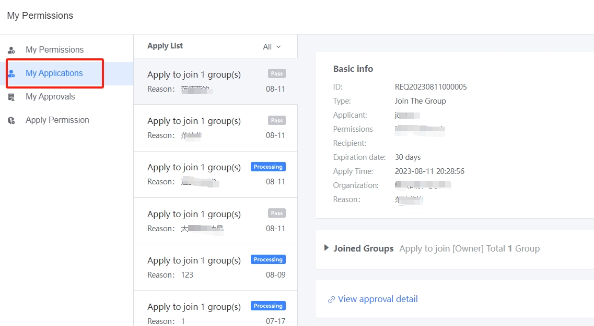
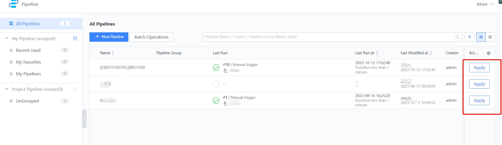
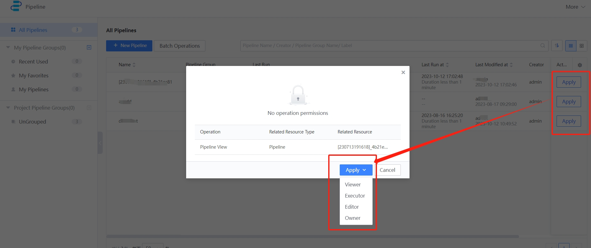

 # ApplyPermission 

 There are two entry points for applyPermission: 
 - Unified applyPermission entry 
 - The closest apply entry when the operation resources noPermission 

 ## Unified applyPermission entry 

 From the "My Permissions" entry in the upper right corner of the navigation and user information drop-down menu, click "applyPermission" as shown in the following figure: 

  

 1. project: The target project of the application.  You can apply to programs other than the confidential project. 
 2. select userGroup: You can query the target user group's approval criteria. 
    - If you have joined a project, you can approve the resources under the project (such as pipeline, ticket, environment, node, etc). 
    - If you have not joined the project, you cannot approve the resources under the project, but only search the userGroup at the project level. 
     
 3. You can choose the duration of the request, up to 1 year.  Can be renewed after expiration 
 4. Reason: Description clearly the reason for application, and evaluation approver 

 Click Submit System automatically generates a Permission Request form: 
 - userGroup at project level, to be approved by the project manager 
 - userGroup at the resource level, to be approved by the resource owner 

 After the bill of lading, you can check the progress of the request form in "My Request": 

  

 After the application form has been approved, the applicant receives the corresponding auth. 

 ## Applying a nearby resource entry 

 Take Pipeline as an example. If there is no pipeline to view, there is an "applyPermission" button in the pipeline operation position: 

  

 Click to select the pipeline userGroup you want to join, as shown below: 

  

 After selecting a userGroup, go to the applyPermission page and select the appropriate userGroup by default: 

  

 After the bill of lading, you can check the progress of the application form in "My Application": 

  