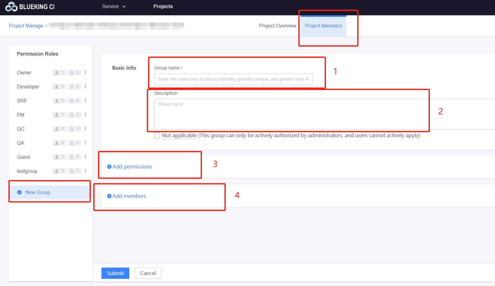
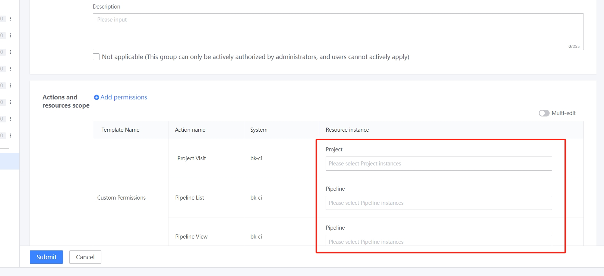
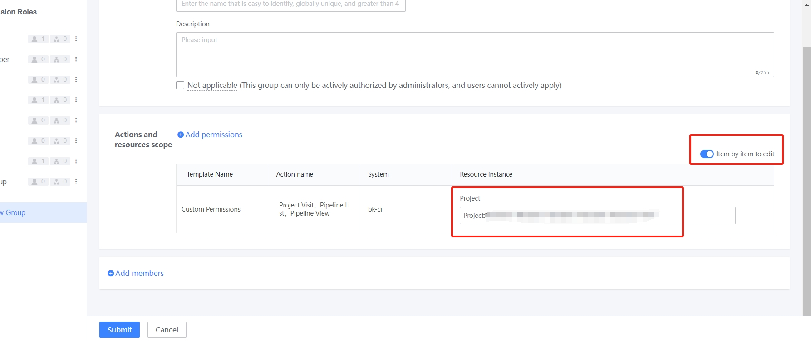
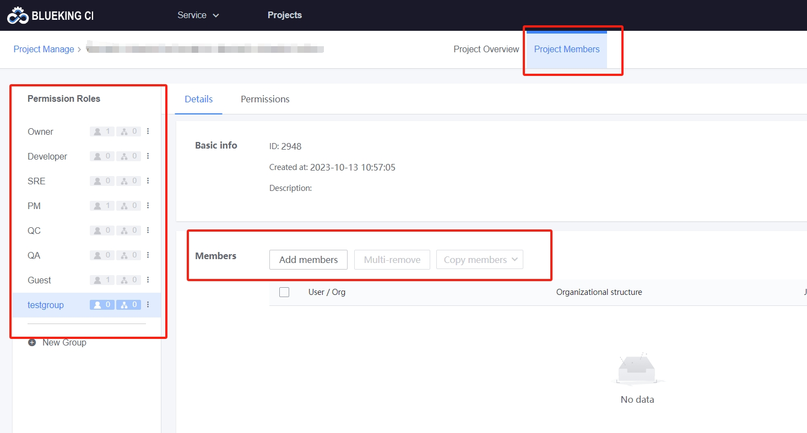

 # Customize userGroup at project level 

 The default project userGroup. Except for members of the Administrator group, who have permission to manage all resources under the project, other user groups have only New and List permissions by default. 

 If the default userGroup does not meet the management requirements, such as the scene where you need to allow the specified user to view allPipelines under the project, you can approve the user group at the project level. 

 ## Step 1 Type projectManage 

 Click "userManage" at the entry of switchProject to quickly enter the projectManage interface, the entry is as follows: 

  

 ## Step2 Add a customize userGroup 

  

 The add userGroup entry is at the bottom of the left navigation. click on it to create a new page, as shown in the figure above. 

 1. groupName: The name of the user group 

 2. description: Describes the authentication scope and applicable scene of a usergroup.  It is recommended to be filled in to provide reference for administrator to append group members and user to apply userGroup 

 3. append group auth: defines the operation and scope that users can perform in a userGroup. 

 Take the "Allow the specified user to view all pipelines under the project" scenario as an example: 

  

 - First select the Pipeline Operation view 
 > The system will automatically select "Access Project" and "Pipeline List" because you need to enter the project to view the pipeline, and you need to see the corresponding pipeline in the Pipeline List. 
 - After clicking Determine, the page will look like this: 

  

 - Setting the resource scope for each operation 
    - Different operations correspond to different resource types, which must be set on an item-by-item basis if necessary 
    - In the current example, you can run Batch Edit and select the The current project 

     

 4. add group members 

 When you create a userGroup, it (not required). You can create a group before you add a member. 

 The append group member page is as follows: 

  

 - When you add group members, you can add them by person or by organizational architecture. 

 Complete the above 4 steps and click "Submit" to successfully create a custom UserGroup. 