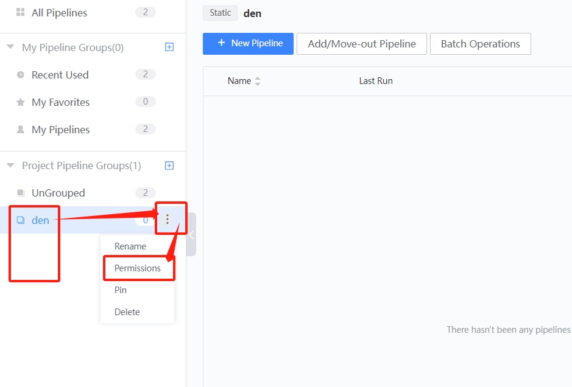
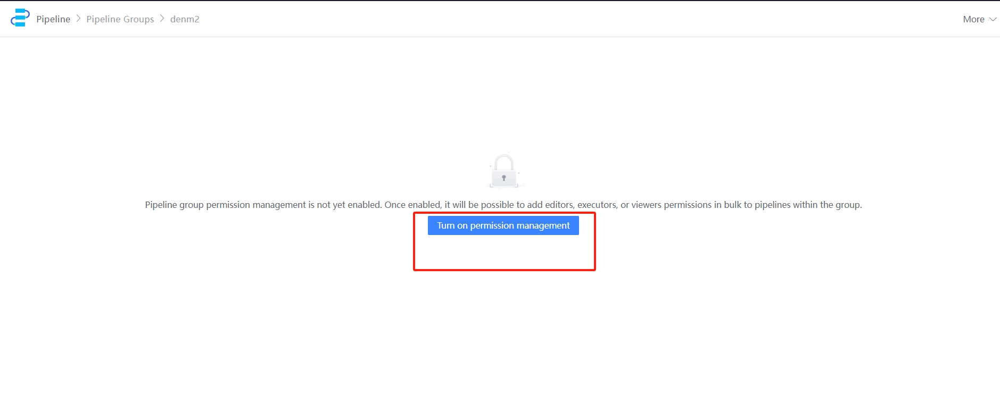

 # Auth to manage a batch of pipelines approve pipelineGroup 

 After pipeline are group management, members can be added to the pipelines in the group in batches approve the pipelineGroup.  The input is as follows 

  

 Permissions is not enabled for pipelineGroup by default. After Enter it is as follows 

  

 After permissions are enabled, you can add edit, execute, or view permissions to pipelines in the group in batches. 

  

 The member auth appended to a pipelineGroup and the member permissions added to a single pipeline are superimposed. 

 When a pipeline A joins a pipelineGroup with permissions enabled, the view member on the pipeline group has the view permission of A. When A is removeFrom from the pipelineGroup, the view member on the pipeline group loses A's view auth. 