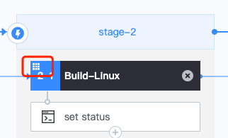

 # EnableMatrix 

 In the BK-CI Pipeline scheduling interface, after append One job, you can edit the job attribute and Enable Matrix. The enabling interface is as shown in the following figure: 

  

 If checked, Matrix will be Enable (it will Take Effect only when the corresponding Parameter are Fill In in According to the subsequent step) 

 After enableMatrix, there is a strategy logo in the upper left corner of the Pipeline edit interface: 

  

 # Matrix setting 

 The Matrix setting consists of the following Five Parameters: 

  

 ## Strategy 

 The Parameter strategy is the basis for splitting the Matrix into multiple jobs.  The value format is Object&lt;String, List<String>&gt;, YAML syntax. 

 For example, if the Parameter CPU is amd64 and the service webhook and apiserver are build separately, the strategy Set as follows: 

 ``` 
 cpu: [ amd64 ] microservice: [webhook, apiserver]  
 ``` 

 When execute, 1*2 jobs will be Generate: 

 - job0：cpu=amd64, microservice=webhook 
 - job1：cpu=amd64, microservice=apiserver 

 ## IncludeCase 

 On the Base of the strategy, additional Parameter combinations can be append.  The value format is list&lt;object&lt;String, String&gt;&gt;, YAML syntax. 

 ### Base on the strategy shown in 2.1, add combinations with the same Name but different variableVal 

 For example, when append CPU=arm64, build the webhook service: 

 ``` 
 - cpu: arm64  microservice: webhook 
 ``` 

 At this point, One job will be added to 2.1: 

 - job2：cpu=arm64, microservice=webhook 

 ### Append One extra attribute to Parameters combination in the strategy shown in 2.1 

 For example, append an attribute tag=test to the Parameter combination of CPU=amd64, microservice=webhook 

 ``` 
 - cpu: amd64  microservice: webhook  tag: test 
 ``` 

 At this point, there are still two jobs after the Matrix is split, and the tag parameter is added to the One job. 

 - job0：cpu=amd64, microservice=webhook, tag=test 
 - job1：cpu=amd64, microservice=apiserver 

 ## ExcludeCase 

 When a part of the Parameter combinations Generate According to strategy is No Need, it can be excluded approve this setting.  The value format is list&lt;object&lt;String, String&gt;&gt;, YAML syntax. 

 For example, in 2.1, the combination of CPU=amd64, microservice=apiserver is excluded: 

 ``` 
 - cpu: amd64  microservice: apiserver 
 ``` 

 ## FastKill 

 Selected by default.  When Enable, if any job in the Matrix failed, all jobs pause execute Immediately. 

 If it is not Enable, it will wait until all jobs are execute before ending 

 ## MaxConcurrency 

 The default is 5. 

 The Matrix setting may Generate a large number of jobs, and concurrent operation of these jobs may result in insufficient resources. For example, if the Limit of concurrent jobs in a single project exceeds 50, fail, or the machine cannot be obtained due to insufficient machine resources.  Therefore, the number of concurrent needs to be Limit. 

 Maximum no more than 20. 

 # Accessing var 

 ## Accessing Matrix setting in jobMatrix 

 Access setting properties approve the matrix context, such as ${{ matrix.CPU }},${{ matrix.microservice}}, for example: 

  

 The Matrix setting can be referenced in the following locations: 

 -  Referenced in task input parameter under job 


 ## Accessing Output var of Upstream step in jobMatrix 

 Multiple jobs Generate approve Matrix have the same layout, and the Name output by plug-ins are also the same. They cannot be accessed through the original variable access method of BK-CI. The local variables generated under the current job should be accessed through the steps context. 

 For example, if a step with step-id "build" is definition in this job, The step Output var a, and subsequent steps can be accessed approve ${{ steps.build.outputs.a }} 

 [Set Output var in bash Plugin](../../../Concepts/Variables.md) 


 ## Accessing Matrix Output var Downstream of jobMatrix 

 For example, in One job-id of "build_job" definition step-id of "build" step, The step Output var a, the subsequent sequence of different jobs can be accessed in two ways: 

 - This can be approve ${{jobs.build_job.  <matrix-index>.steps.build.outputs.a }} to access the value of One of the split jobs (where matrix-index is the sequential value of the split result, starting at 0) 
 - You can jobs.build access an array of the entire matrix Output approve ${{ www.example.com _job.steps.build.outputs.a }} 


 # Parameter strategy of jobMatrix is dynamic Set approve var 

 ## The entire strategy Parameter is dynamic passed in as a var 

 example of var Assign: 

 ``` 
 echo "::set-variable name=parameters::{\"service\":[\"api\",\"project\",\"gateway\"],\"cpu\":[\"amd64\", \"arm64\"]}" 
 ``` 

 example of strategy Parameter Settings: 

 ``` 
 ${{ fromJSON(variables.parameters) }} 
 ``` 

 ## A Dimension Value in a strategy Parameter is Passed in as a var 

 example of var Assign: 

 ``` 
 echo "::set-variable name=file_list::[\"file_1\",\"file_2\",\"file_3\"]" 
 ``` 

 example of strategy Parameter Settings: 

 ``` 
 file_list: ${{ fromJSON(variables.file_list) }} b: [1,2] 
 ``` 

 **Note: fromJSON is a built-in Function of BK-CI. Currently only support be used when configuring the matrix Parameter strategy** 