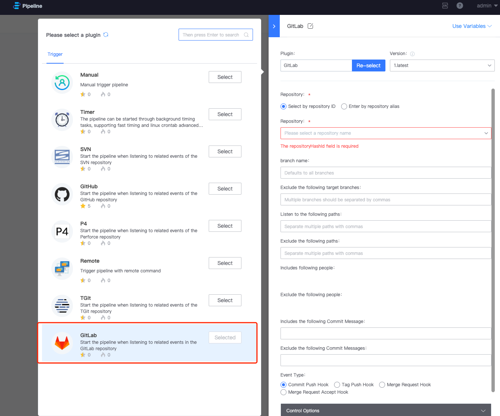

 # gitlab Code event triggering Pipeline 
 **Usage Scene:** Pipeline is auto triggered when Code changes occur, such as code submit and code merge. 

  

  

 ##triggerType 
 1. Commit Push Hook Triggered when Code is submit 
 2. Tag Push Hook Triggered when Code with tag is submitted 
 3. Merge Request Hook Triggered when there is a Code merge 
 4. Merge Request Accept Hook Triggered when Code is merged 

 ##Parameter 
 Different triggerType have different Parameter 
 codelib Common Params, the repository to listen for code event 

 ### Commit Push Hook 
 1. branch: The branch where the Code event occurred 
 2. Excludes the following target Branch: Excluded branches do not trigger Pipeline even if there is a Code event 
 3. Listen to the following path: If a Code change occurs under The path, Pipeline is triggered 
 4. Exclude the path where the Pipeline is not triggered if a Code change occurs 
 5. Include the following person: If the author of the Code change is The person, Pipeline is triggered 
 6. Exclude the following person: If the author of the Code change is The person, Pipeline is not triggered 
 7. It contains the following Commit Message: If the commit information of the Code change contains The information, Pipeline is triggered 
 8. Exclude the following Commit messages: If the commit information of the Code change contains The information, Pipeline is not triggered 
   
 ### Tag Push Hook 
 1. branch: The branch where the Code event occurred 
 2. Monitor the following tag: If the submit Code contains the following tag, Pipeline will be triggered 
 3. Exclude the following tag: If the submit Code contains the following tag, Pipeline is not triggered 

 ### Merge Request Hook 
 1. branch: the branch where the merge event occurs. If you want the Pipeline to be triggered when the dev branch is merged into the master branch, fill in the branch name as master 
 2. Exclude the following target Branch: If the target branch of the merge event is the following branch, Pipeline is not triggered 
 3. Listen to the following source Branch: If the source branch of the merge event is the following branch, the pipeline is triggered. 
 4. Exclude the following source Branch: If the source branch of the merge event is the following branch, Pipeline is not triggered 
 5. Listen to the following path: merge event target Branch contains Code changes in the following paths, triggering Pipeline 
 6. Exclude the following path: The merge event target Branch contains Code changes for the following paths, the Pipeline is not triggered 
 7. Include the following people: merge event The Pipeline is triggered if the target Branch contains Code changes by the following people 
 8. Exclude the following persons: If the target Branch of the merge event contains Code changes by the following persons, Pipeline will not be triggered 
 9. It contains the following Commit Message: Pipeline is triggered if the target Branch of the merge event contains the following commit information 
 10. Exclude the following Commit messages: If the target Branch of the merge event contains the following commit information, Pipeline will not be triggered 

 ### Merge Request Accept Hook 
 1. branch: The branch where the merge accept event occurs. If master receives the merge Request from the dev branch, Fill In master as the branch name. 
 2. Exclude the following target Branch: If the target branch of the merge accept event is the following branch, Pipeline is not triggered 
 3. Listen to the following source Branch: If the source branch of the merge accept event is the following branch, the pipeline is triggered. 
 4. Exclude the following source Branch: If the source branch of the merge accept event is the following branch, Pipeline is not triggered 
 5. Listen to the following path: merge accept event The Pipeline is triggered if the target Branch contains Code changes in the following path 
 6. Exclude the following path: merge accept event The Pipeline is not triggered if the target Branch contains Code changes for the following paths 
 7. Include the following people: merge accept event The Pipeline is triggered if the target Branch contains Code changes by the following people 
 8. Exclude the following people: merge accept event the target Branch contains Code changes by the following people, Pipeline is not triggered 