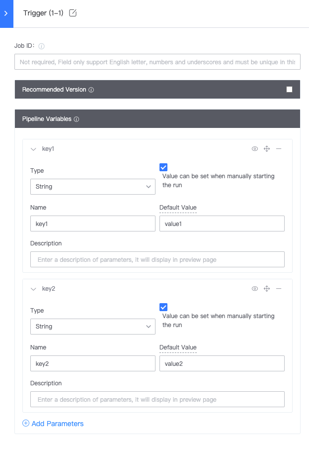

 # Remote triggerType 
 The Remote triggerType allows the user to Start Up Pipeline with One simple curl command, and the initiator is the final edit of the pipeline 

 Using the Remote triggers remote Plugin: 

  

 The remote Plugin provided the curl command to trigger this Pipeline: 

  


 If a var is definition in Trigger, the Parameter provided during the actual call will Overwrite the default arguments 

  

  


```bash
curl -X POST devops.bktencent.com/ms/process/api/external/pipelines/171de37d50494111ae03a9b8c291f9b1/build -H "Content-Type: application/json" -d "{\"key1\":\"value1\",\"key2\":\"value2\"}"
```
