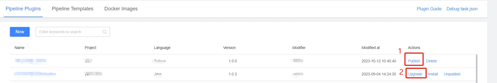
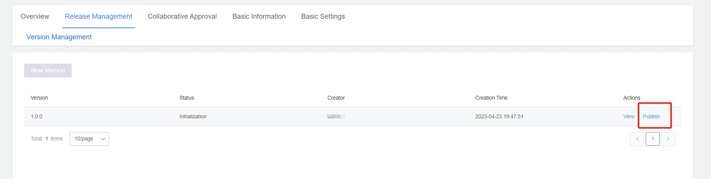
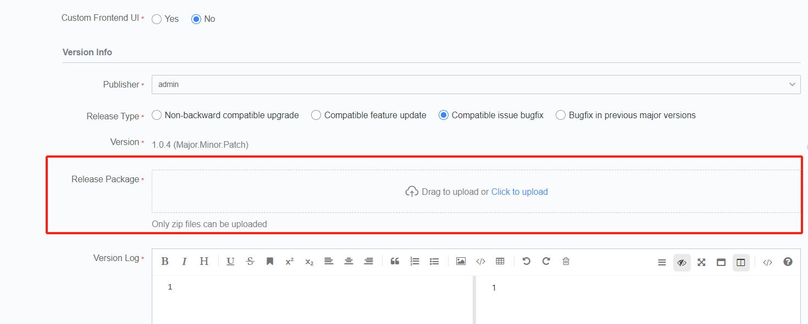
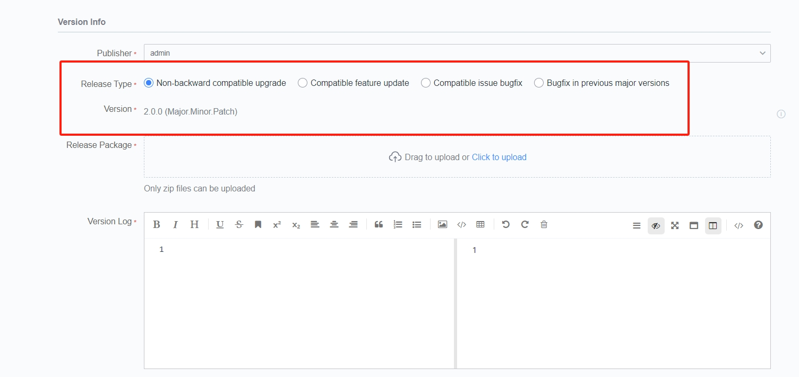

 # Upload One Pipeline Plugin 

 > After the Plugin is Develop, Release the plug-in to the R & D store approve the store workbench, provided it for user to append to Pipeline. 

 ## Entry 

 In the workbench list, click the following entry to initiate the Release Flow: 
  

 1. When first Release, the entry name was "On the shelf" 
 2. When upgrading a version, the entry name is Upgrade 

 Or, in the Plugin Release Manage-> Version Management interface, initiate the publishing Flow: 
  

 1. When the current version is not in the end state, the possible Operation here are: 
    - Listing: The first version Enter the listing Flow 
    - Progress: Enter the Release Flow page 
 2. New version can only be new when the The latest version of is in end status 

 ## Fill In Plugin Information/upload Plug-in Release Package 

 You can Revise the Basic Information of a plug-in when Plugin is added/upgraded, as shown below: 
  
  

 1. Applicable Job Type: 
    - Corresponding to Pipeline Job type. Please select According to the actual application of the Plugin 
    - If you select the wrong one, you need to new version Revise 
 2. Release Package: 
    - The atomCode in task.json must be the same as the ID Fill In when addAtom in [Develop One Pipeline Plugin](start-new-task.md), otherwise the upload will failed 

 When upgrading a Plugin, there are Three upgrade modes: 
  

 1. Incompatible upgrade: 
    - The Plugin Input and Output are different, or the input and output are the same, but the function logic is greatly changed, which is incompatible with the old version 
    - After this type of Release, the Pipeline that Used The Plugin will not be Auto Upgrade, and user need to manual Revise the versionNum 
    - versionNum +1 
 2. Compatible feature Update: 
    - The Plugin Input Output are compatible with the old version, only used when the function is Update or new (does not affect the users who have Used it) 
    - After this type of Release, the Pipeline that Used The Plugin and whose versionNum selected as [majorVersion.latest] will auto use the New version of the plug-in without manual edit the pipeline 
    - Minor versionNum +1 
 3. Compatibility bug fixes: 
    - Plugin Input Output compatible with old version, only bug fixes 
    - After this type of Release, the Pipeline that Used The Plugin and whose versionNum selected as [majorVersion.latest] will auto use the New version of the plug-in without manual edit the pipeline 
    - Amendment No.+1 

 ## Test/Release Plugin 

 > Fill In the information, submit, Enter the Release Flow, you can Test-> re-transfer package-> test, until the Plugin meets the expectations, manual Continue process to release the plug-in to the store 

  

 1. Test: click to location to the Pipeline service of the Plugin Debug project. You can append the current plug-in to the pipeline and verify whether the UI and functions meet the expectations. 
 2. Re-upload the package: when the Test finds a problem, after repair, upload the Release package and test again 
 3. Continue: Test OK, after meeting expectations, Submit Release 
 4. Cancel Release: You can terminate the publication at any time during the publication process 

 > Note: When the Develop Plugin language is Python or Nodejs, there are certain requirements for the plug-in execute environment. 
 > 
 > - [Python Plugin execute environment](../../Developer/plugins/plugin-dev-env/prepare-python.md) 
 > - [NodeJS Plugin execute environment](../../Developer/plugins/plugin-dev-env/prepare-node.md) 