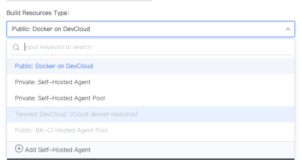
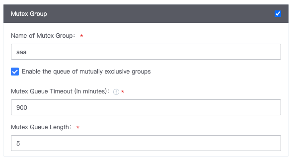

 # Job 

 Job, which can Run in One buildEnvType, such as macOS; It can also be scheduled as a Normal Task that does No Need a buildEnvType.  It has the following characteristics: 

 - Composed of multiple Tasks(Plugin); 
 - One Task failed, The Job fails and the rest of the Tasks will not Run. 

  

 > BK-CI has a built-in Linux Docker BK-CI hosted agent (if The options cannot be selected, please contact your CI platform Administrator), and also supports Windows, macOS, and Linux builders managed by the Business Name itself. 
 > 
 >  

 ## WORKSPACE 

 Each Job has its own WORKSPACE, which is the Run root directory of all Plugin under The Job. 
 > The file in WORKSPACE auto Generate by BK-CI will not disappear with Docker destory. As long as they are the same Job in the same Pipeline, the files in the following directories are persistent: 
 > 
 > - WORKSPACE： If not specified, it is the entire WORKSPACE directory of the current Job 
 > - maven cache: /root/.m2/repository 
 > - npm cache: /root/Downloads/npm/prefix 
 > - npm cache: /root/Downloads/npm/cache 
 > - ccache cache: /root/.ccache 
 > - gradle cache: /root/.gradle/caches 
 > - golang cache: /root/go/pkg/mod 
 > - scale cache: /root/.ivy2 
 > - scale cache: /root/.cache 
 > - yarn cache: /usr/local/share/.cache/ 

 If One Job contains a "subPipeline call" Plugin, the WORKSPACE of the Job under The sub-pipeline will also follow the above principle, completely independent, and will not conflict with the WORKSPACE of the parent pipeline. 

 ## general options for Jobs 

 ### jobOption 

 approve Advance Flow control, you can definition the logic for the Job to run. 

  

 ### Mutex Group 

 The mutex group is designed to solve the resources conflict problem when the concurrent build uses the same agent, and the same mutex group is Set for different jobs of different Pipeline. 

  

 ## Next you may need 

 - [Task](Task.md) 
 - [Stage](Stage.md) 