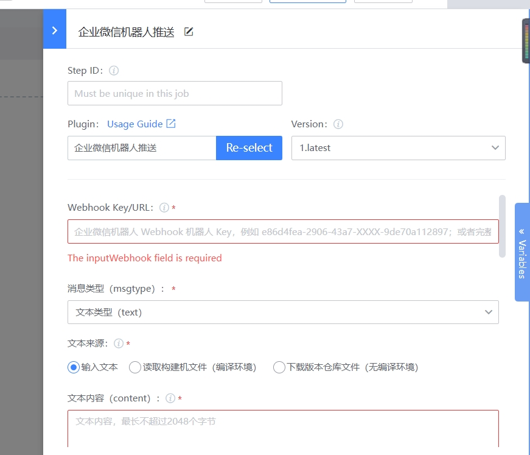
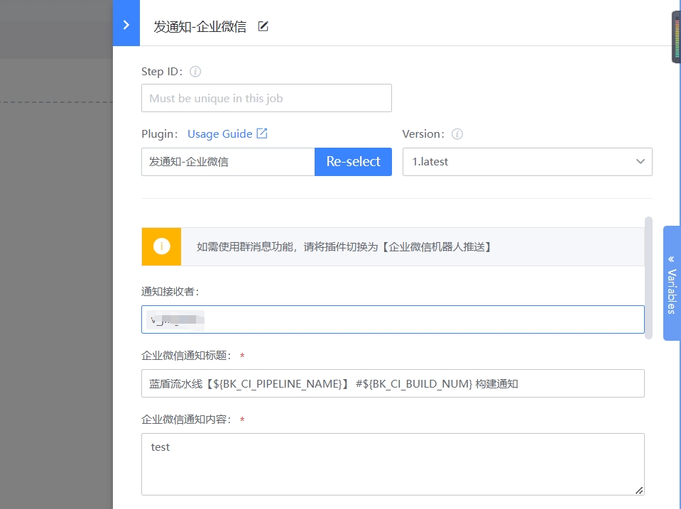
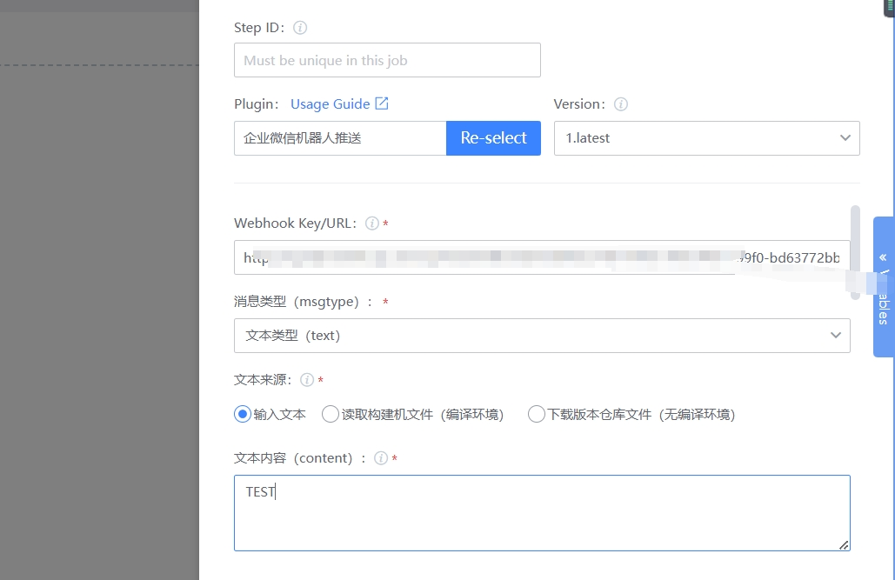

 # sendmsg-general messaging plugin 


 ## Idea 

 WeCom messages and email can be sent using the BlueKing ESB API. Group messages can also send text format information and markdown information via the group robot webhook address. The text format information also supports @ group members. These message sending requirements are collected in one plugin. 

 ## Frontend design 

 You must support three message sending methods: WeCom message, email, and group robot, and all three must be optional. You can choose more than one. 

  

 Other input items, such as sending destination, message title, message content, etc., that need to be entered by the user are displayed when the user selects the message sending method.  For example, when the "WeCom" sending method is selected, the "Sending Destination", "Message Title" and "Message Content" input boxes are displayed.  Email and WeCom share three input fields: "Send Destination," "Message Title," and "Message Content," so select one of the two options of "WeChat at Work" and "Mail" to display these input fields. 

  


 Select "Send to WeCom group robot", the following config item will appear, "@ group member" will only appear if the message type selected by the user is "Text". 

  

 ## Backend Design 

 ## Basic concepts 

 A plugin usually consists of three parts: 

 1. task.json: definition front-end input components, output var, plugin execute entry 
 2. sdk package: provides various function needed to develop plugin 
 3. user code 

 Take the Python plugin as an example. For more information, see [plugin-demo-python](https://github.com/ci-plugins/plugin-demo-python) 


 ``` 
 |- demo # Plugin package 
    |- demo # Plugin package 
        |- __init__.py py # Py Package ID 
        |- command_line.py # Command line file, user code section 
        |- error_code.py # Customize error code 
    |- python_atom_sdk # Develop plugin SDK package 
    |- MANIFEST.in # package file type declaration 
    |- requirements.txt # dependency declaration 
    |- setup.py # execute package setup 
    |- task.json # definition frontend input components, output var, plugin execute entry 
 ``` 

 It is recommended to develop directly on the plugin demo Python code 

 The project architecture: 

 ``` 
 |- plugin-sendmsg-demo # Plugin package 
    |- sendmsgDemo # Plugin package 
        |- __init__.py py # py package ID 
        |- command_line.py # Command line file, user code section 
        |- error_code.py # Customize error code 
    |- python_atom_sdk # Develop plugin SDK package 
    |- MANIFEST.in # package file type declaration 
    |- requirements.txt # dependency declaration 
    |- setup.py # execute package setup 
    |- task.json # definition frontend input components, output var, plugin execute entry 
 ``` 

 ### task.json 

 task.json contains the following field: 

 1. atomCode: description the plugin name 
 2. Execution: description the plugin package name, development language, plugin execution pre-command, plugin command 
 3. input: description of the input components 
 4. output: description of the output var 

 ``` 
 { 
  "atomCode": "sendmsgDemo", 
  "execution": { 
    "packagePath":"sendmsgDemo-1.0.0.tar.gz", # Package name, Fill In according to the actual package version, which should be consistent with the definition in setup.py 
    "language": "python",                       # Development language 
    "demands": [                                # Plugin Run pre-command 
        "pip install sendmsgDemo-1.0.0.tar.gz" 
    ], 
    "target": "sendmsg"                          # Plugin Command 
  }, 
  "input":{},                                    # Input Components 
  "output": {}                                   # Output var, no output variable can not definition output 
 }  
 ``` 

 #### Input Components 

 select multiple for sending messages. There are two types of checkbox Components: atom-checkbox-list and atom-checkbox. The difference between the two is that the options of atom-checkbox-list are arranged horizontally, and the options of atom-checkbox occupy One line.  WeCom and Email can share message content, so atom-checkbox-list is suitable for these two methods. Group message sending select type (text/markdown) and does No Need title, so atom-checkbox Components is suitable. 

 ``` 
 { 
    ...... 
    "input":{ 
        "send_by":{ 
            "label": "Message sending method",         #Components ID 
            "type": "atom-checkbox-list", #Components type is atom-checkbox-list 
            "list": [                      #options list, there will be two options, WeCom and Email 
                { 
                    "id": "weixin",        #options ID 
                    "name": "WeCom",     #options name 
                    "disable": false,      #Set to not select 
                    "desc": "The message will be sent to the WeCom Apply account. You need to setting the enterprise WeChat application account information in the ESB first"   #options description 
                }, 
                { 
                    "id": "mail", 
                    "name": "Email", 
                    "disable": false, 
                    "desc": "Send to Email" 
                } 
            ] 
        }, 
        "send_by_robot":{ 
            "label": "",                    Not filled 
            "type": "atom-checkbox",        #Components type is atom-checkbox 
            "default": false,               #defaultValue, false means not checked by default 
            "text": "Send to WeCom group robot",   #options Function 
            "desc": ""                      #options description 
        } 
    } 
 } 
 ``` 

 The task.json visualization result can be viewed in the BK-CI "store"-"Console"-"Debug task.json" 

  


 Next append three input Components: "Send target," Message Title "and" Message content ". These three input components will be displayed when the user selects" WeCom "and" Email ". 

 ``` 
 { 
    ...... 
    "input":{ 
        ...... 
        "send_to": { 
            "label":"Send target",  
            "default":"",                   
            "placeholder":"username", 
            "type":"vuex-input",               #Components type is vuex-input, single-line textarea 
            "desc":"Use semicolons; Separate Multiple username ", 
            "required": true,                  #Whether it is Must, if true, it means it must have a value 
            "rely":{                           Depends dependOn Other Components 
                "operation": "OR",             #Dependence logic or, that is, any result of the following expression can be Display 
                "expression":[                 #The name and values of multiple Components that depend on it. When any of the following values appears in the send_by component, the current component will be Display 
                    { 
                        "key": "send_by", 
                        "value": ["weixin","mail"] 
                    } 
                ] 
            } 
        }, 
        "title": { 
            "label":"title", 
            "default":"", 
            "placeholder":"title", 
            "type":"vuex-input", 
            "desc":"WeCom message title or Email title", 
            "required": true, 
            "rely":{ 
                "operation": "OR", 
                "expression":[ 
                    { 
                        "key": "send_by", 
                        "value": ["weixin","mail"] 
                    } 
                ] 
            } 
        }, 
        "content": { 
            "label": "message content", 
            "default": "", 
            "type": "vuex-textarea",    #Components type is vuex-textarea, multi-line textarea 
            "disabled": false, 
            "hidden": false, 
            "isSensitive": false, 
            "desc": "Message content, var ${VAR} can be used", 
            "required": true, 
            "rely":{ 
                "operation": "OR", 
                "expression":[ 
                    { 
                        "key": "send_by", 
                        "value": ["weixin","mail"] 
                    } 
                ] 
            } 
        }, 
    } 
 } 
 ``` 
 Visualization result: 

  


 Next, append the Input Components of the WeCom group robot 

 ``` 
 { 
    ...... 
    "input":{ 
       ...... 
        "robot_key": { 
            "label":"robot webhook key", 
            "default":"", 
            "placeholder":"robot webhook key", 
            "type":"vuex-input", 
            "desc":"WeCom robot webhook key, it is recommended to use credentialManage", 
            "required": true, 
            "rely": {                #dependOn send_by_robot Components value is true, that is, check "Send to WeCom robot" 
                "operation":"AND", #dependency logic AND 
                "expression": [ 
                    { 
                        "key": "send_by_robot", 
                        "value": true 
                    } 
                ] 
            } 
        }, 
        "msgtype": { 
            "label": "message type", 
            "type": "selector",       #type is selector, listOptions 
            "default": "text", 
            "desc": "message type can be text/markdown", 
            "options": [              #Drop Down Items 
                { 
                    "id": "text", 
                    "name": "text", 
                    "desc": "", 
                    "disable": false 
                }, 
                { 
                    "id": "markdown", 
                    "name": "markdown", 
                    "desc": "", 
                    "disable": false 
                } 
            ], 
            "rely": { 
                "operation": "AND", 
                "expression": [ 
                    { 
                        "key": "send_by_robot", 
                        "value": true 
                    } 
                ] 
            } 
        }, 
        "mentioned": { 
            "label": "@ group member", 
            "type": "vuex-input", 
            "default": "", 
            "placeholder": "PonyMa;@all", 
            "desc":"Use WeCom UserId, which can be obtained approve Administrator backend. Separate multiple UserIds with semicolons", 
            "rely": { 
                "operation":"AND",   #Depending on logical AND, the current Components will be Display only when the user selects "Send to WeCom group robot" and the message type is selected as text 
                "expression":[ 
                    { 
                        "key":"send_by_robot", 
                        "value": true 
                    }, 
                    { 
                        "key": "msgtype", 
                        "value": "text" 
                    } 
                ] 
            } 
        }, 
        "robot_content": { 
            "label": "group message content", 
            "type": "vuex-textarea", 
            "default": "", 
            "placeholder":"When the message type is markdown, markdown syntax can be used", 
            "desc":"When the message type is markdown, markdown syntax can be used", 
            "required": true, 
            "rely": { 
                "operation": "AND", 
                "expression": [ 
                    { 
                        "key": "send_by_robot", 
                        "value": true 
                    } 
                ] 
            } 
        } 
    } 
 } 
 ``` 
 Visualization result: 

  

  


 If the Plugin needs to Set the Output, you can append an output Field 

 ``` 
 { 
    ...... 
    "output": { 
        "TEST_OUTPUT": { 
            "type": "string", 
            "description":"Test Output" 
        } 
    } 
 } 
 ``` 

 Visualization result: 

  

 ### sdk 

 Focus on several function (s) to complete the Business Name logic coding 

 1. sdk.get_input() Gets the Input of the Components, and the values obtained by the input component are all string 

 ``` 
 # Input 
 input_params = sdk.get_input() 
 send_to = input_params.get("send_to", None) 

 # Note the Components of atom-checkbox-list type. The obtained string needs to be converted into a list using json.loads 
 send_by_str = input_params.get("send_by", None) 
 send_by= json.load(send_by_str) 

 # atom-checkbox gets string 'true' or 'false', which needs to be Transformer to True/False 
 send_by_robot_str = input_params.get("send_by_robot", None) 
 send_by = True if send_by_robot_str == 'true' else False 
 ``` 

 2. sdk.get_sensitive_conf("key") Get Private setting var 

 ``` 
 bk_app_code = sdk.get_sensitive_conf("bk_app_code") 
 ``` 

 3. sdk.log log Output 

 ``` 
 sdk.log.info("xxx") 
 sdk.log.error("xxx") 
 ``` 

 4. exit_with_succ(data=data) Set Output var 

 ``` 
 # exit_with_succ encapsulates sdk.set_output, which is convenient for user to Set Output var 
 data = { 
    "TEST_OUTPUT":{ 
        "type": sdk.output_field_type.STRING,   #The type Set by task.json needs to be consistent 
        "value": "test"                         #The value of the Output var must be consistent with the declared type 
    } 
 } 

 exit_with_succ(data=data) 
 ``` 

 ## Packaging 

 1. Enter the root directory of the Plugin Code project 

 2. execute python setup.py sdist (or Other packaging commands, this example takes sdist as an example) 

 3. add file anywhere, such as sendmsgDemo_release 

 4. Copy the execute package produced in Step 2 to sendmsgDemo_release 

 5. append task.json file to sendmsgDemo_release 

 6. Use `ZIP -r www.example.com sendmsgDemo_sendmsgDemo.ziprelease` to zip the sendmsgDemo_release. 

 setup.py 

 ``` 
 # -*- coding: utf-8 -*- 

 import os 

 from setuptools import setup, find_packages 

 BASE_DIR = os.path.realpath(os.path.dirname(__file__)) 


 def parse_requirements(): 
    """ 
    @summary: Get dependencies 
    """ 
    reqs = [] 
    if os.path.isfile(os.path.join(BASE_DIR, "requirements.txt")): 
        with open(os.path.join(BASE_DIR, "requirements.txt"), 'r') as fd: 
            for line in fd.readlines(): 
                line = line.strip() 
                if line: 
                    reqs.append(line) 
    return reqs 


 if __name__ == "__main__": 
    setup( 
        version="1.0.0", 
        name="sendmsgDemo", 
        description="", 

        cmdclass={}, 
        packages=find_packages(), 
        package_data={'': ['*.txt', '*.TXT', '*.JS', 'test/*']}, 
        install_requires=parse_requirements(), 

        entry_points={'console_scripts': ['sendmsgDemo = sendmsgDemo.command_line:main']}, 

        author="vincohuang", 
        author_email="vincohuang@tencent.com", 
        license="Copyright(c)2021-2022 vincohuang All Rights Reserved.  " 
    ) 
 ``` 

 ## project Reference 

 plugin-demo-python: https://github.com/ci-plugins/plugin-demo-python 

 plugin-sendmsg-demo: https://github.com/wenchao-h/plugin-sendmsg-demo 