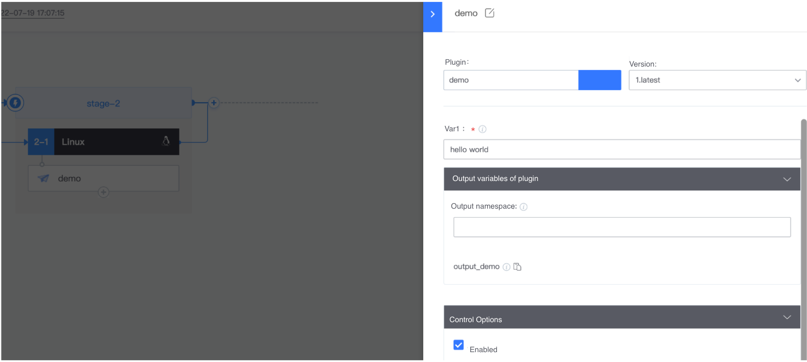
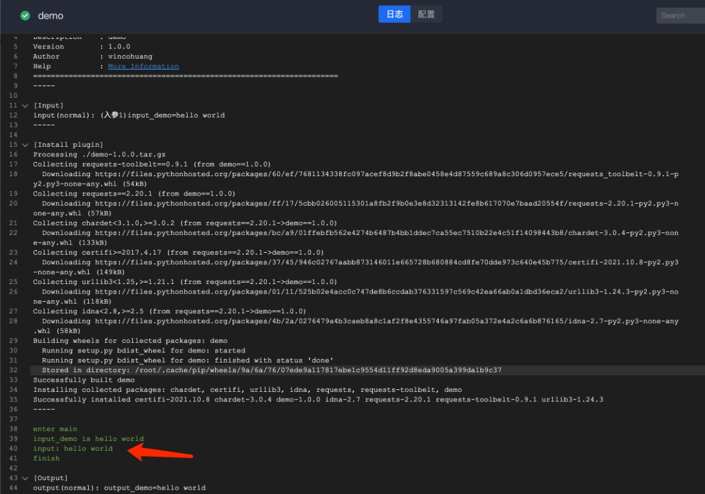

 # Python Develop Plugin Guide 

 ## Develop Plugin Framework 

 * Develop can use their favorite framework development, there is no hard and fast requirement 
 * example organizes Plugin as source Release packages 
  * Advantages: cross-platform, simple and compact package 
  * Disadvantages: pip install is required before execute. When Other third-party packages are dependent, you need to be able to access the imageSource install the dependent packages 

 **One. The overall structure of the Plugin Code project is shown as follows:** 

 ```text 
 |- <Your Plugin logo>              #Plugin package 
    |- <Your Plugin logo>          #Plugin package 
        |- __init__.py py     # py Package ID 
        |- command_line.py    #Command entry file 
    |- python_atom_sdk        #Develop Plugin SDK Package 
    |- MANIFEST.in            #Package file type declaration 
    |- requirements.txt       #Dependency Statement 
    |- setup.py               #execute package setting 
 ``` 

 **Two. How to Develop Plugin:** 

 > For example, see [plugin-demo-python](https://github.com/ci-plugins/plugin-demo-python) 

 * create Plugin Code project plug-in code under the proposed unified Manage of enterprises.  You can contact the Official website of BlueKing to put the general open source Plugin under [TencentBlueKing](https://github.com/TencentBlueKing) for more user to use 
 * Revise the package to a recognizable name, which is recommended to be consistent with the Plugin ID 
 * Implement Plugin functionality 
  * setting task.json. See [Plugin Config Specification](../plugin-dev-standard/plugin-config.md) 
  * For more information about how to write Plugin logic Code, see [Develop Plugin Logic Code](https://github.com/ci-plugins/plugin-demo-python) and [Python_atom_sdk API example](../plugin-sdk/python-atom-sdk.md) 
 * Specification: 
  * [Develop Plugin Specification](../plugin-dev-standard/plugin-specification.md) 
  * [Plugin Config Specification](../plugin-dev-standard/plugin-config.md) 
    * The Plugin front-end can be setting not only approve task.json, but also customize: [customize Plugin UI Interaction Guide](../plugin-dev-standard/plugin-custom-ui.md) 
  * [atomOutput specification](../plugin-dev-standard/plugin-output.md) 
  * [Plugin Error Code specification](../plugin-dev-standard/plugin-error-code.md) 
  * [Plugin Release Package Specification](../plugin-dev-standard/release.md) 

 **Three. How to package and Release:** 

 1. Enter the root directory of the Plugin Code project 
 2. execute the package command package 

   ```text 
   # This example takes the sdist command of setuptools as an example 

   python setup.py sdist 
   ``` 

 3. add file anywhere. Name example: release\_pkg = <Your Plugin ID>\_release 
 4. Copy the execute package produced in Step 2 to <release\_pkg> 
 5. append the task.json file to the task.json under <release\_pkg> See the example, setting According to Plugin function. 

   * [Plugin Config Specification](../plugin-dev-standard/plugin-config.md) 
   * example of task. json: 

   ```text 
   { 
       "atomCode": "demo", 
       "execution": { 
           "language": "python", 
           "packagePath": "demo-1.1.0.tar.gz",             # Relative path of Plugin install package in Release package 
           "demands": [ 
               "pip install demo-1.1.0.tar.gz --upgrade"   # Operation to be performed before execute the target command, such as install dependencies, etc. 
           ], 
           "target": "demo" 
       }, 
       "input": { 
           "inputDemo":{ 
               "label": "Input example",  
               "type": "vuex-input", 
               "placeholder":"Input example", 
               "desc": "Input example" 
           } 
       }, 
       "output": { 
           "outputDemo": { 
               "description":"Output example", 
               "type": "string", 
               "isSensitive": false 
           } 
       } 
   } 
   ``` 

 6. In the <release\_pkg> directory, type all the file into `ZIP` package. 

 example of `ZIP` package structure: 

 ```text 
 |- demo_release.zip         # Release Package 
   |- demo-1.1.0.tar.gz    # Plugin execute Package 
   |- task.json            # Plugin Config file 
 ``` 

 After the packaging is complete, you can Test or publish the plug-in in the Plugin workbench 


 ## Develop Plugin Logic Code 
 The Plugin logic Code is mainly in command_line.py. The following demo example demonstrates One simple plug-in that gets user input values from the Input box input_demo, prints the user input to the log, and Output to the plug-in result. 
 1. `sdk.input().get("key")` is the method provided python_atom_sdk to obtain the Input of the Plugin. Key is the name of the input Components, which is defined in task.json. In this example, the input component is input_demo. 
 2. the output_demo is an Output Components, and that value of the output_demo can be refer to by subsequent JOB of the Pipeline as the output result of the plug-in 
 3. In task.json, input represents the UI Input Components. all input UI components that interact with the user should be placed in input. The Component Name needs to be unique. You can view the task.json visualization result in BK-CI "store"-"Console"-"Debug task.json" 

 more sdk interfaces, please refer to: [python_atom_sdk interface example](../plugin-sdk/python-atom-sdk.md) 
 more task.json Basic Info, please refer to: [Plugin Config Specification](../plugin-dev-standard/plugin-config.md) 
 more use The Case of UI Components, please refer to: [UI Components example](../plugin-dev-standard/plugin-config.md) 

```python 

# -*- coding: utf-8 -*-

from __future__ import print_function
from __future__ import absolute_import
from __future__ import unicode_literals
import python_atom_sdk as sdk
from .error_code import ErrorCode

err_code = ErrorCode()


def exit_with_error(error_type=None, error_code=None, error_msg="failed", platform_code=None, platform_error_code=None):
    """
    @summary: exit with error
    """
    if not error_type:
        error_type = sdk.OutputErrorType.PLUGIN
    if not error_code:
        error_code = err_code.PLUGIN_ERROR
    sdk.log.error("error_type: {}, error_code: {}, error_msg: {}".format(error_type, error_code, error_msg))

    output_data = {
        "status": sdk.status.FAILURE,
        "errorType": error_type,
        "errorCode": error_code,
        "message": error_msg,
        "type": sdk.output_template_type.DEFAULT,
        "platformCode": platform_code,
        "platformErrorCode": platform_error_code
    }
    sdk.set_output(output_data)

    exit(error_code)


def exit_with_succ(data=None, quality_data=None, msg="run succ"):
    """
    @summary: exit with succ
    """
    if not data:
        data = {}

    output_template = sdk.output_template_type.DEFAULT
    if quality_data:
        output_template = sdk.output_template_type.QUALITY

    output_data = {
        "status": sdk.status.SUCCESS,
        "message": msg,
        "type": output_template,
        "data": data
    }

    if quality_data:
        output_data["qualityData"] = quality_data

    sdk.set_output(output_data)

    sdk.log.info("finish")
    exit(err_code.OK)


def main():
    """
    @summary: main
    """
    sdk.log.info("enter main")

    # Input 
    input_params = sdk.get_input() 

    # Get the Input Field value named input_demo 
    input_demo = input_params.get("input_demo", None) 
    sdk.log.info("input_demo is {}".format(input_demo)) 
    if not input_demo: 
        exit_with_error(error_type=sdk.output_error_type.USER, 
                        error_code=err_code.USER_CONFIG_ERROR, 
                        error_msg="input_demo is None") 

    # Plugin Logic 
    sdk.log.info("input: %s"%input_demo) 

    # Plugin execute result, Output data 
    data = {
        "output_demo": {
            "type": sdk.output_field_type.STRING,
            "value": input_demo
        }
    }
    exit_with_succ(data=data)

    exit(0)
```

The corresponding task.json: 
```json
{
    "atomCode": "demo",
    "execution": {
        "packagePath": "demo-1.0.0.tar.gz",
        "language": "python",
        "demands": [
            "pip install demo-1.0.0.tar.gz"
        ],
        "target": "demo"
    },
    "input": {
        "input_demo": {
            "label":"Input Parameters1",
            "default":"",
            "placeholder":"Input Parameters1",
            "type":"vuex-input",
            "desc":"Input Parameters1",
            "required": true
        }
    }, 
    "output": {
        "output_demo": {
            "description" : "example Output",
            "type": "string",
            "isSensitive": false
        }
    }
}
```

Results of the:



