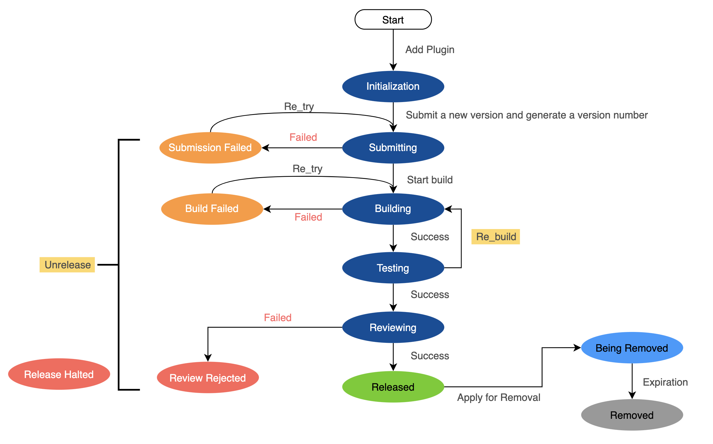

 # Develop Plugin Specification 

 ## Plugin definition Specification 

 * The Basic Information of the Plugin description class is definition through the online Flow 
  * When addAtom in the Plugin workbench, you can specify the ID, name and Development language 
    * The identity and Development language cannot be modify after initialization 
  * When listing/upgrading a Plugin, you can update the Basic Information of the plug-in, including name, Service Classification, description and other information 
 * The Plugin execute, Input, and Output definition are defined approve a file named task.json in the plug-in Code Repository 
  * task. json Storage under that root path of the Plugin Code Repository 
  * For more information, please see [Plugin Config Specification](plugin-config.md). 

 ## Develop Plugin Specification 

 * Plugin are encapsulated as command line execute commands: 
  * The call command is specified by the `execution.target` Field of task.json 
    * execution.target formatted as string 
    * You can use ${var\_name} to get the var in the call command 
  * If dependencies need to be install before invoking execute, the installCommand is specified by the `execution.demands` Field of task.json 
    * execution.demands is a list, and multiple installCommand can be setting 
    * The installCommand can use ${var\_name} to get the var 
 * Plugin Input Field values, obtained from the specified input file 
  * Input information fileName, specified by the Env Variables `bk_data_input` 
  * Input the storage path of the information file, specified by the Env Variables `bk_data_dir` 
  * The content of the Input information file is json, as shown in the following example: 

    ```text 
    { 
        "inputVar_1": "value1", 
        "inputVar_2": "value2" 
    } 
    ``` 

  * When using SDK for Develop, you do not need to pay attention to the location and naming of Input file. You can use the methods provided by SDK to obtain input. 
 * atomOutput information is notified to BK-CI agent approve writing file 
  * Output information fileName, specified by the Env Variables `bk_data_output` 
  * Storage path of Output information file, specified by Env Variables `bk_data_dir` 
  * For the format of Output information file, see [atomOutput Specification](plugin-output.md). 
  * When using SDK for Develop, you do not need to pay attention to the Output file location and name. You can use the method provided by SDK to Set the output. 
 * Plugin execute result will be determined by two Alert Rules: 
  * If the `status` Field is specified in the Output information file, the value of The field shall prevail 
  * If the Output information file is not specified, the Return value of the Plugin execute command shall prevail 
    * The Return value is 0, indicating Success 
    * The Return value is not 0. failed 
 * Plugin log Output to Console 
  * the BK-CI agent display that collected Console log (Stdout stream, standard Error stream) to Pipeline foreground 
 * Plugin level Sensitive information Manage 
  * Sensitive data such as Account password can be managed in the Plugin Set → Private settings interface 
    * Platform will encryption Storage 
    * When used in the Plugin, you can obtain it by approve the method provided by the SDK. 
 * Plugin Error Code and error Service Classification 
  * Develop Plugin need to subdivide the various Scene that lead to the failure of plug-in execution, identify them with Error Code, and provide detailed description and solutions in plug-in log and instructions for user to quickly locate and solve problems 
  * Develop Plugin need to classify Error that cause plug-in fail, and specify Error Type errorType for Measure statistics 

 ## Plugin Code Package management Specification 

 The Plugin Code recommended to be Manage in a unified way for Share, handover and system management. 

 * The enterprise is managed under one group According to enterprise Code Manage mode 
 * This is a general Plugin. You can contact BK-CI customer service and submit it Components [TencentBlueKing](https://github.com/TencentBlueKing). 

 ## Plugin atomHelpDoc (Detailed description) Specification 

 * Purpose 
  * Convenient for user to understand the working principle and scope of application of Plugin 
  * It is convenient for user to get solutions when they encounter problems 
 * provided mode 
  * When Release a Plugin, Fill In the plug-in detailed description Field 
  * view Plugin Details interface in the store will be displayed, or the help for viewing the Execution Log will be displayed. 
 * The The document **should be written in markdown language**. It is recommended to include the following content: 

 ### 1. Plugin Introduction 

 * Brief Description Plugin features 

 ### 2. Plugin application Scene 

 * Detailed description Plugin application Scene 

 ### 3. Plugin usage Limit and restricted solutions 

 * \[Optional\] Call Frequency Limit 
 * \[Optional\] Concurrency Limit 
 * \[Optional\] Network Limit, Description network requirements, or network Alert Rules to be apply 
 * \[Optional\] If the Plugin has auth control (IP, user, etc.), please description the apply method in detail 

 ### 4. Common Reasons and Solutions for Plugin failed 

 * List possible failed reasons and Error Code, and provide solutions for Scene to facilitate user to quickly solve problems 

 ## Plugin new/Release Flow 

 ### Plugin status Flow Chart 

  

 ### Flow description 

 * Develop addAtom in the Plugin workbench 
  * The purpose of initialization is to get the unique Plugin ID in the system 
 * Develop develop Debug Plugin locally 
 * After Debug OK, new version in the Plugin workbench and Start Up the Release Flow 
 * After submit of version: 
  * Enter the Test Stage 
    * Develop can create a Test Pipeline under the Debug project select when addAtom to determine whether the plug-in Meets The expectations 
    * During the Test, if any problem is found, you can fix the Code bug and re-pack it, and then re-send the package to Continue test 
  * After the Test OK, the Develop clicks [Continue] to Confirm, and the version is Success released to the store 