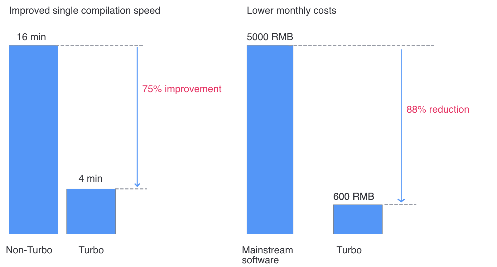

 # Pocola--Improve service compilation speed by 75% approve pay-as-you-go Acceleration Plan

 || 
 |:-| 
 |**Products involved:** BK-CI Pipeline; Turbo Turbo| 
 |**Scene Tag:** Postpaid Acceleration Plan; C++ Code compilation; Turbo in Windows Subsystem for Linux Scene| 
 |**Problem solved:** Slow compilation of C++ Code| 

 shanghai Pokola Network Technology Co., Ltd. was founded in Shanghai Year 2021 by Chen Min, a well-known producer.  The company focuses on the field of large-scale high-precision MMORPG/ARPG. CEO Chen Min has been in charge of "Dragon Valley mobileGame" and "Ragnarok Oringin"(Hanbok "Ragnarok Oringin") mobile games, and has two consecutive Success hot project experience. 
 In the communication with Pokola, we learned that with the progress of Develop, Pokola's development Efficiency on the service side began to be gradually affected by the compilation efficiency: 
 1. It totalTime nearly 16 minutes to compile a single time on the service (C++). **Develop resources are occupied during compilation** 
 2. The mainstream **commercial Turbo software in the market has high software license fees**, and **limited support for compilation acceleration in Windows Subsystem for Linux Scene** 

 **Based on Pokola's description, we Recommended Pokola's pay-as-you-go BK-CI Turbo.  BK-CI Turbo is One set of compiler solutions implemented by BK-CI based on distributed compiler technology, cache technology and container technology.** After the Acceleration Plan was delivered, Pocora Test its service (C++) build and found that The solution had obvious effects in terms of compilation speed and Cost: 

 1. **The single compile time is reduced from 16 minutes to 4 minutes, with a speedup of 75%.** 
 2. **The usage Cost is only 600 yuan/month (see the appendix for Processing method, the actual cost fluctuates according to the monthly compilation volume), which has a huge cost advantage over a mainstream commercial software.** 

  

 Regarding the effect of Turbo, the principal of service Develop at Pokola said,"BK-CI's Turbo better supports the acceleration of compilation Task in the WSL environment than the commercial software we tried.  At the same time, the compilation acceleration is based on the actual usage mode, so that we can accelerate the service compilation work at a very low Cost, which greatly improves the Efficiency of our back-end Develop!” 

 Next, BK-CI will continue to optimize the compilation effect and Cost of C++ and begin to explore solutions to accelerate the compilation of client UE4 Code. Stay tuned! 

     
 **APPENDIX: USE Cost ESTIMATION** 

 Turbo Turbo Computing resources (4C8G*24 copies) Cost: 

 CPU per Core 0.055 yuan/hour * 4C * 24 copies/ 60 minutes = 0.088 yuan/minute 

 Memory 0.032 yuan/hour per G * 8G * 24 copies/ 60 minutes = 0.1024 yuan/minute 

 The Cost of a single acceleration for 4 minutes (0.088 + 0.1024)* 4 = 0.76 yuan 

 Estimated monthly Cost of Turbo Turbo: 

 20 build/day * 20 days/month * 0.76 RMB/time + 300 RMB/month (VPN fee)= 600 RMB/month 

 Estimated monthly Cost of a mainstream business software: 

 USD 10/Core/month * 16 cores * 5 Develop machines ≈ 5000 yuan/month 