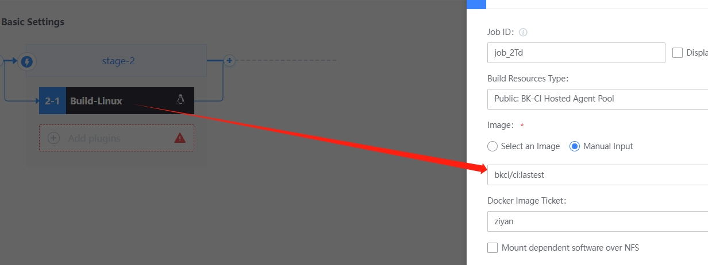
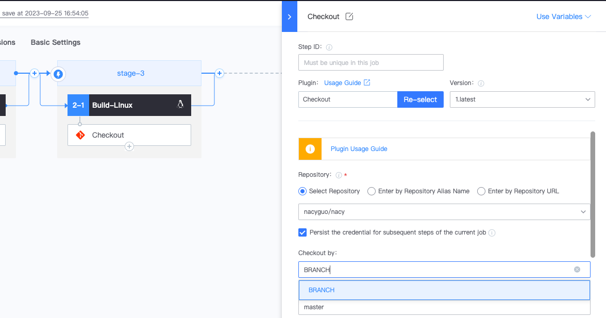
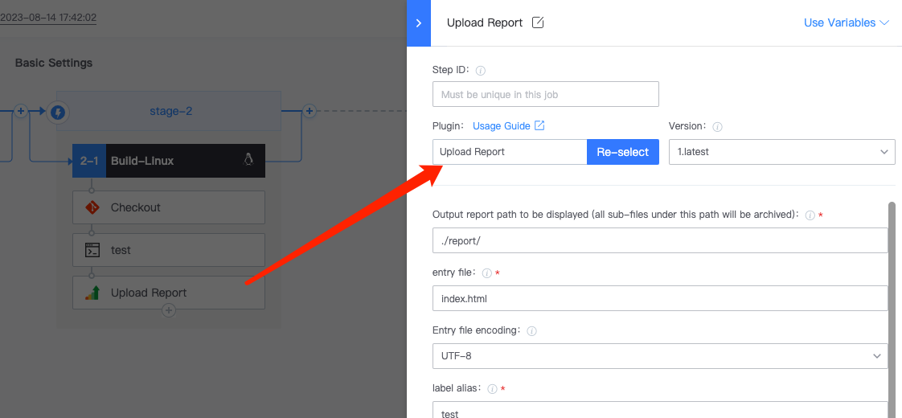
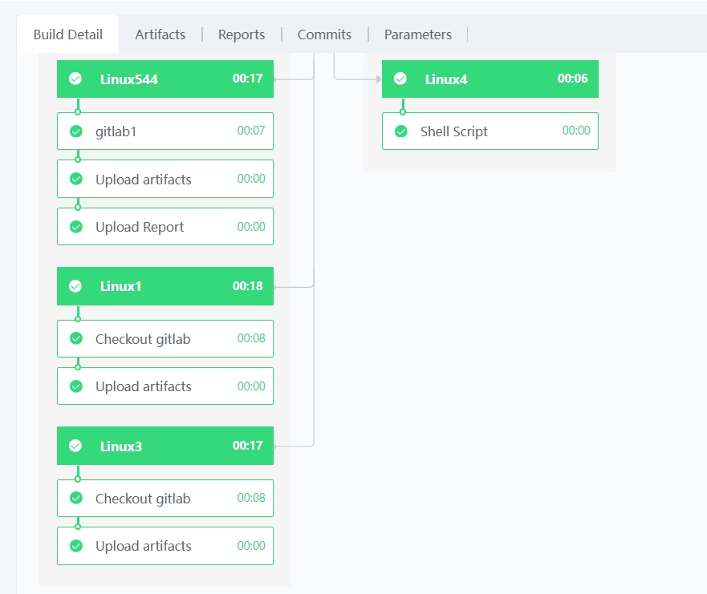

 # NodeJS Demo 

 This article will show you how to compile NodeJS projects in BK-CI. 

 ## Preparing Materials 

 - One NodeJS project: <https://gitlab.com/BK-CI/gs-maven.git> 
 - One CI image with the npm command: <https://hub.docker.com/r/bkci/ci> 

 ## Detailed step 

 1. To link OK gitlab Code Repository with BK-CI,[see](../Quickstarts/Link-your-first-repo.md) 
 2. create One blank Pipeline 
 3. append the Linux buildEnvType to Job2-1 and fill in the image address: bkci/ci:latest 
    
 4. append the following 3 Plugin in turn: 
      * Checkout Git
       
      * Shell Scripts 

      ```bash 
      #!/  usr/bin/env bash 
      npm run test 
      ``` 

     * Upload report
       

 5. Run Pipeline and observe the result 
  