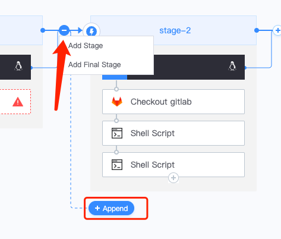
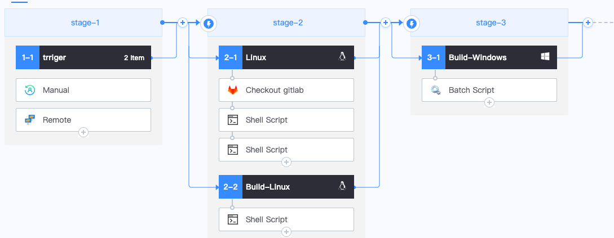
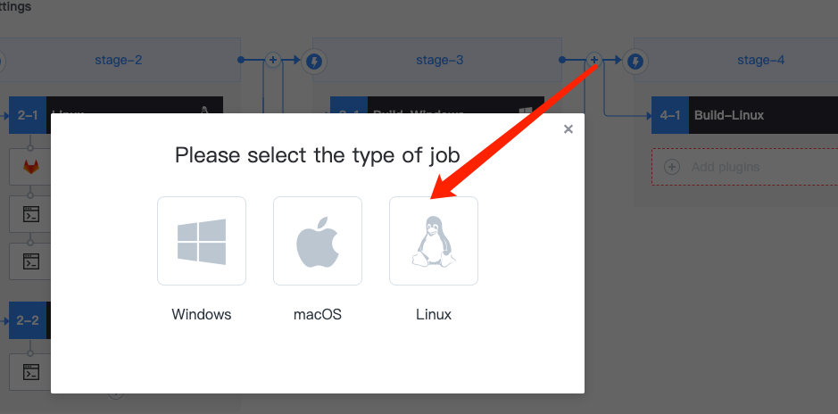
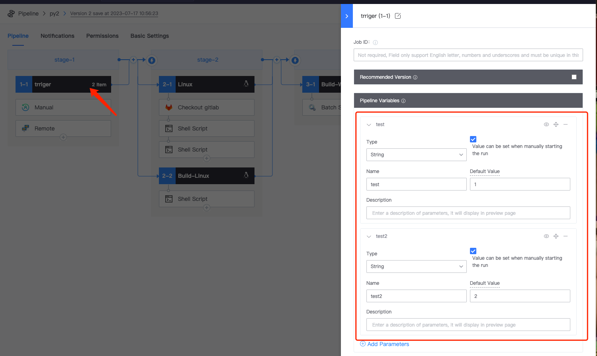
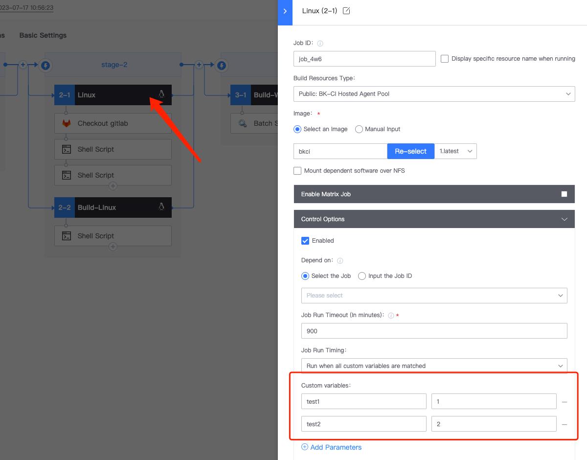
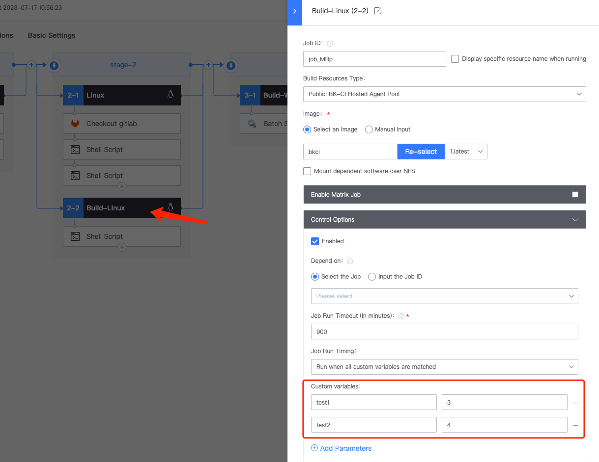

 # Pipeline condition judgment 

 * add multiple stages 

  

 append shell script Plugin, and Input the Script at will: echo 1 

  

 append One parallel stage&#x20; 

  

  

 Add One new stage at the back 

  

  

 append finally stage 

 Finally stage: One last step of the Pipeline runs, whether the pipeline fail or Success, the step definition by the finally stage is executed 

  

  

 *   Scene: After setting the above Pipeline, if there is such One use requirement, only execute 2-1 Job and SKIP 2-2 and 3-1 if certain conditions are met 

    approve setting var 

    * definition pipelineVar, click trigger, and define two variables, test1 and test2 

  

 * setting the Job of 2-1, select varMatch/B, and Input the two variables test1 and test2 just defined. The value are the same as those defined by trigger 

  

 * setting the Job of 2-2, click 2-2 Linux, select "varMatch", and Input the two custom variables test1 and test2 just defined. Write the values as you like, which are different from the values defined by trigger just now 

  

 *   setting the 3-1 stage, select varMatch/B, Input the two user-defined variables test1 and test2. Write the values as you like, which are different from the values defined by trigger just now 

    Note: Pipeline can be setting for stage/Job/Plugin execute conditions 

  

 * execute Pipeline, test1 and test2 value remain default 

  

 view the execute result, and you can see that 2-2Job and stage3 are SKIP directly because the var conditions are not met. 

  