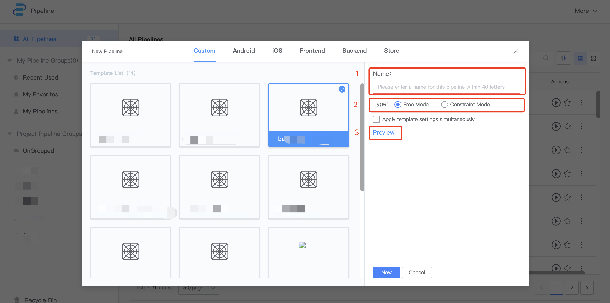
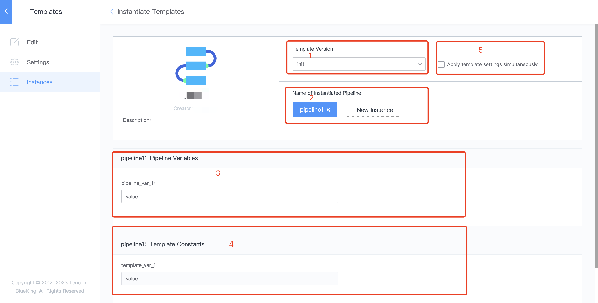
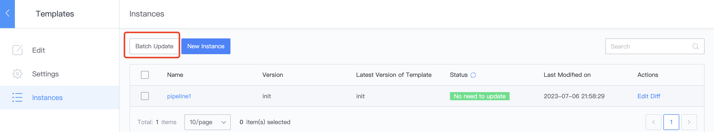

# New pipeline using templates 

 ## Preparations 

 - One template. If there is no template, please refer to [Develop a Pipeline Template](../  Services/Store/start-new-template.md) 

 ## Entry 

 Under Pipeline service, createPipeline-> Create from Template 

 ## Create Pipeline from Template 

  

 1. Pipeline name 
 2. Relationship between instance and template: 
    - Freedom Mode: Once create, there is no link between the instance and the template. You can freely Revise the Parameter and layout of the instance. 
    - Constraint Mode: instances are always controlled by templates. You can only Revise Pipeline Parameter, but not layout and template parameters 
 3. template detail 

 ## Create constraintMode Pipeline 

  

 1. Template Version 
 2. ConstraintMode pipelineName, which can be create in Batch 
 3. Pipeline variables, which can be different for each instance 
 4. Template Constants, which cannot be Revise 
 5. You can select whether to inherit template Set 

 ## Upgrading Constraint Mode Pipeline with One Click approve Template 

 After the template is upgraded, you can upgrade the instance of constraintMode with one click: 

  

 1. batchUpdate after multiple instances are select 
 2. diff, you can view the difference before and after the upgrade 