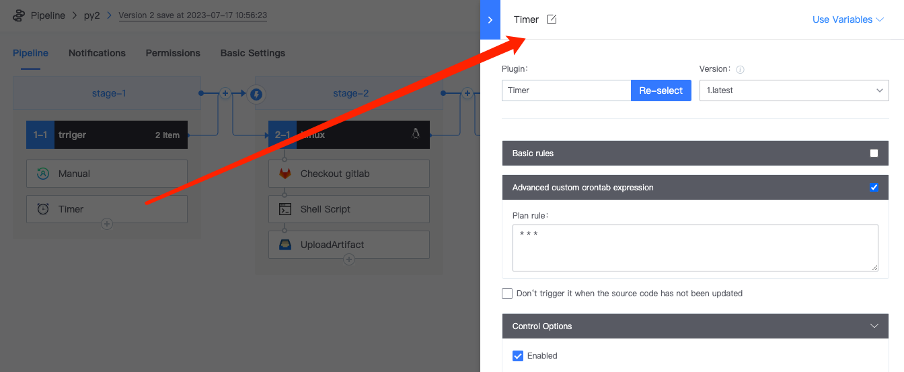
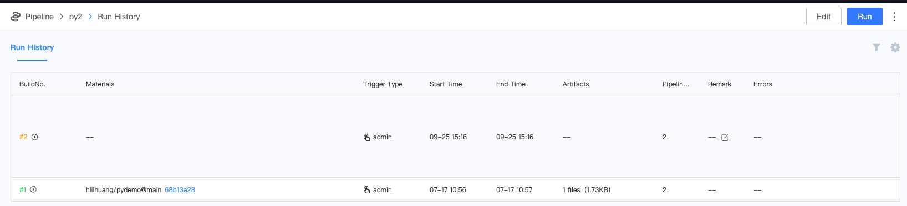
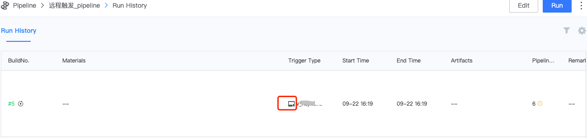

 # Use Pipeline triggerType-manual execute/Cron/Remote triggers, etc. 

 The triggerType is used approve select different type of Plugin under Trigger 

 *   manual execute 

    The default triggerType for createPipeline is manual execute. Here, simply append One stage\ 
    Manual Plugin: manual execute Pipeline, which means that after the pipeline is established, you can Click To Save in the upper right corner and manually click the execute pipeline button 

  

 *   Cron 

    append Timer Plugin, definition crontab Expression 

  

 view the pipelinesHistory, you can see that Pipeline is auto timed to execute One per minutes 

  

 *   Remote triggers 

    append Remote Plugin-can be Remote triggers approve execute a command 

    copy the example command. If trigger has a definition var, the command line will auto Generate a sample with variable Parameter 

  

 execute curl command from the command line 

  

 The Execution record can be view in the Pipeline pipelinesHistory 

  