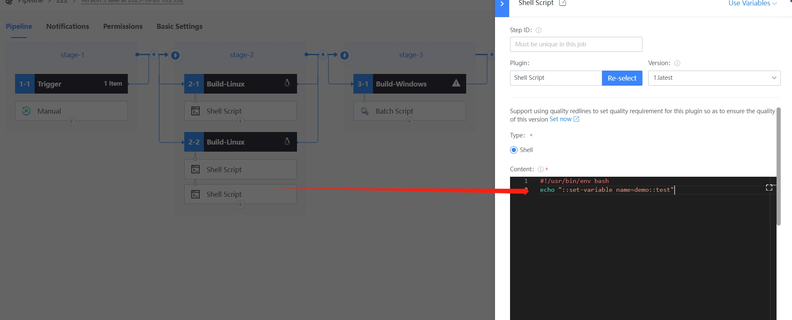
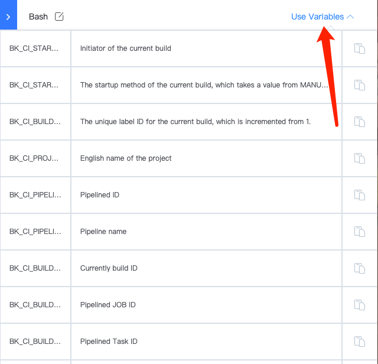

 # pipelineVar usage

 * var Usage Type: 
  * Global Variables reference, shell/python/windows variable reference method 
  * Plugin var Set method and cross-plug-in variable reference 
 * click Trigger to createVariable message 

  

 * append shell Plugin, use ${{message}} to use var 

  

 *   Plugin Set Global Variables method 

    On the Bash Plugin, use print(echo "::set-variable name=demo::test"), which Set One Global Variables: demo (Note: the demo var cannot be used in the current Plugin) 

  

 The variable demo is referenced in shell script and batch script plug-ins in the same way as the variable reference setting by trigger 

  

 *   Pipeline default Global Variables 

    click any Plugin. There is One useParams in the upper right corner. Some variables are definition by default in the Pipeline and can be used directly on the plug-in. The variable reference method is as above 

  