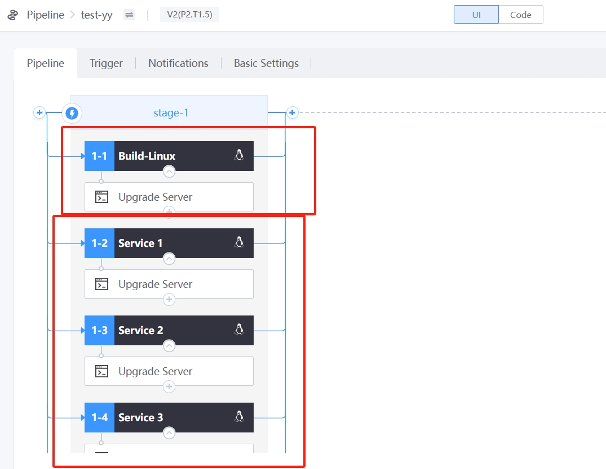
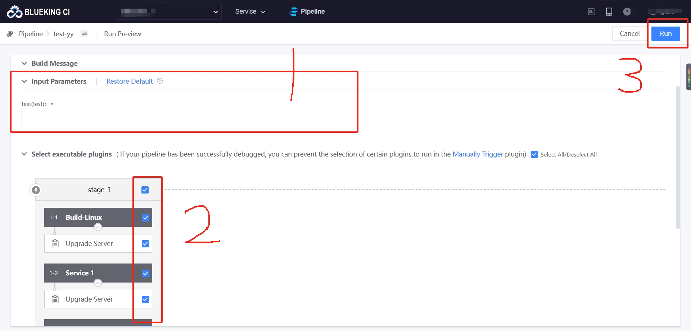
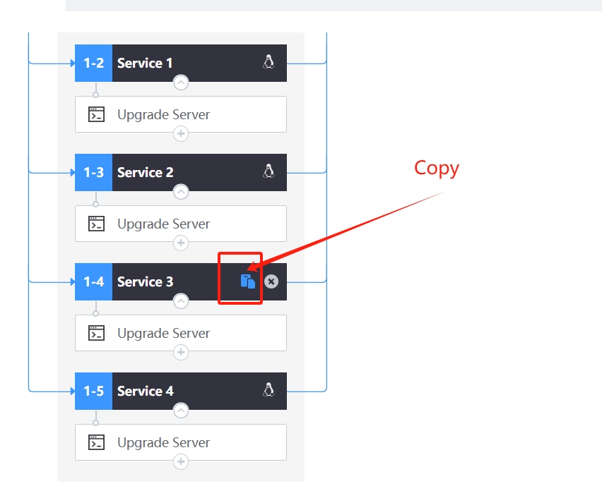

 # Artists Update game resources 

 ## Keywords: Update resources, Art Design 

 ## Business Name Challenges 

 In the process of game development, artists need to Test accept Scene resources and art setting effects, and frequently Update clients and service of different test suits.  However, most artists do not have a background in Linux technology, and need to manual Update the content to P4, and then complete the update of the Linux server environment approve cross-team communication with the cooperation of service Develop and even technology center platform developers.  Communication, collaboration, waiting and other links in the middle may take 10-30 minutes, making it take more than oneHour to complete One small function Test acceptance. 

 ## Advantages of BK-CI 

 BK-CI helps artists to independently Update the service and client environment approve a graphical interface.  Now only one artist can complete it without additional communication. 

 ## Solution 

 First, the Develop configPipeline. The main jobs are: Pipeline trigger, service Update, art Test machine update 

  

 Artists visit the above Pipeline, just "fill in the Parameter","select their own Test machine", click "execute", you can complete the entire resources Update Operation; 

  

 if a new person or a new art machine join, just copy that existing job; The Pipeline changes little, the maintenance is simple; 

  