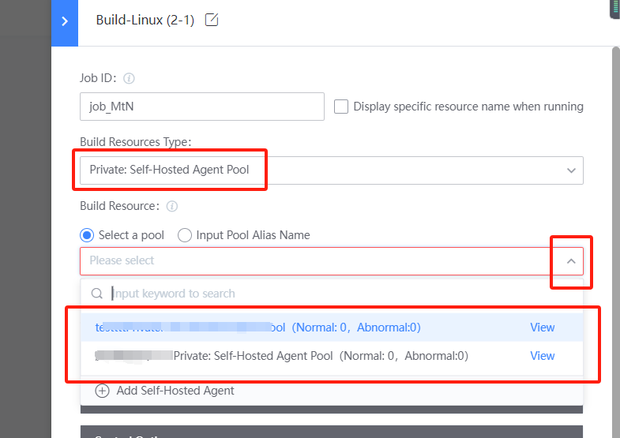

 # Create a Private build cluster 

 ## Keywords: Private, cluster 

 ## Business Name Challenges 

 if multiple single agent are use all that time, and different Pipeline are artificially assigned to different build machines, not only the maintenance of the build machine itself will become a burden, but more importantly, the use Efficiency of the build machine is low. 

 ## Advantages of BK-CI 

 BK-CI Pools can integrate multiple single agent into a build cluster to improve overall resources utilization Efficiency 

 ## Solution 

 1. Open BK-CI and select "Pools" 

  

 2."new" environment, select the build node 

  

  

 3. In the Pipeline Stage setting, select Private: build cluster uses 

  

 After the cluster is formed, the Algorithm for Job to find the construction node is as follows: 

  