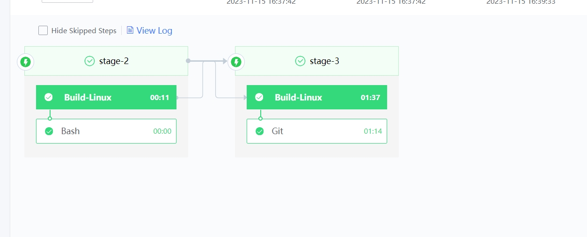

 # Client auto Performance Test 

 ## Keywords: Test auto, PerfDog 

 ## Business Name Challenges 

 PerfDog is One performance tool for mobile platforms, supporting Android and iOS platforms.  You can customize auto performance Test approve the Two Develop of PerfDogService, which is open to the public.  PerfDog data is Collections by human, so the Efficiency and accuracy of collection are low.  At the same time, because the iteration speed of the transfer test package is very fast, the pressure of human Test is very high. 
 
 ## Advantages of BK-CI 

 On BK-CI, the PerfDog Service performance auto interface approve encapsulated and called to achieve the purpose of automatically Collections data and label different Scene Stage. 

 ## Solution 

 1. PerfDog Instructions for use 

 PerfDog website: https://perfdog.qq.com/ 

 PerfDogService Instructions for use: https://bbs.perfdog.qq.com/article-detail.html?  id=54 

 2. Combination of Client Performance Test and PerfDog Service 

 Encapsulates the API of PerfDog Service, adds functions such as time Update thread, and append the function of parsing the Full data of PerfDog to extract the desired content.  (For specific implementation and Description, please contact PerDog official website customer service) 

 3. setting BK-CI Pipeline 

 auto construction is carried out in combination with BK-CI Pipeline and wetest cloud machine to complete automatic data Collections. 

  