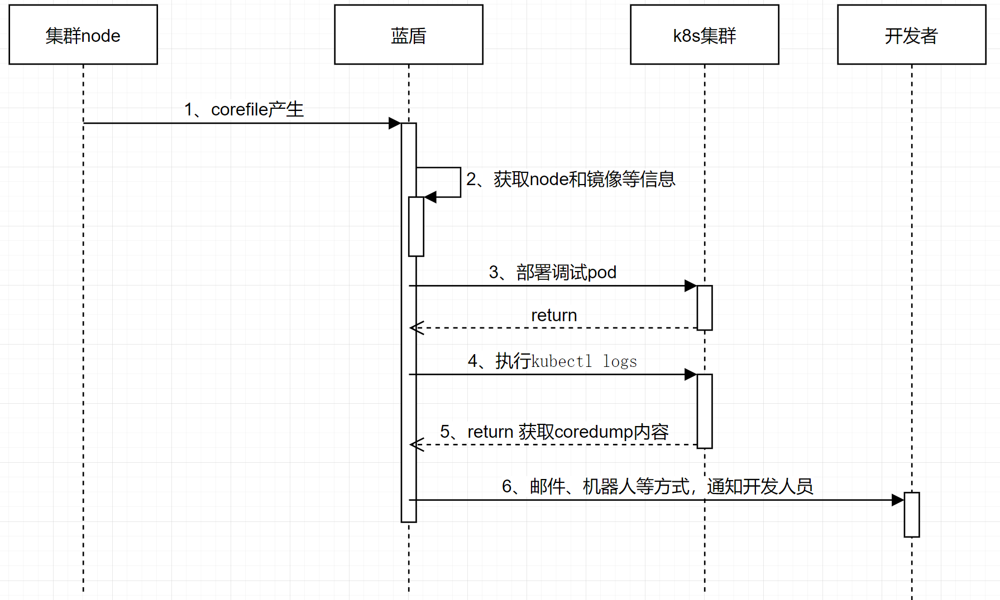
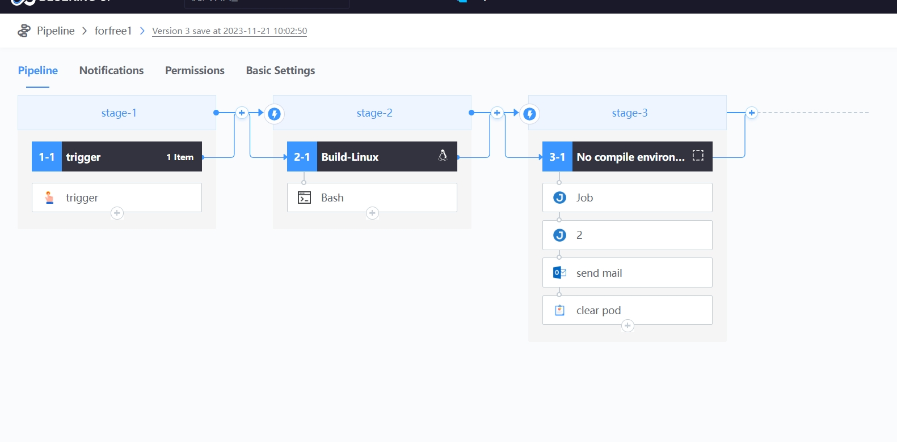

 # Cloud environment abnormal Location 

 ## Keywords: Cloud environment, corefile 

 ## Business Name Challenges 

 After the service is uploaded to the cloud, the game process is cored. Due to pod node drift and other reasons, it is difficult to find the corefile and Debug the breakpoint. 

 ## Advantages of BK-CI 

 auto pull up the Debug node approve BK-CI, and Output the coredump content to the backend Develop by Email. If there is a breakpoint requirement, you can debugConsole pod on the cluster master node to debug and locate it. 

 ## Solution 

 1. The overall Flow is as follows: 

 ● Node machine monitors whether corefile is generated 

 Idea: Write a corefile file monitoring Script, and use the BlueKing "Job System"-Cron function to Remote triggers the BK-CI Pipeline when a corefile is new. 

 Sample of the core part of the Script, for reference only 

 file_list=`find /data/corefile  -mmin -3 -name  "core_*"` 

 ● After Remote triggers the BK-CI Pipeline, Deploy Debug pods according to the node ip and image versionNum 

 ● After the Debug pod is Start Up, approve kubectl command to get the coredump content 

 ● Notify Develop by Email or robot 

 ● Develop can debugConsole pod by themselves to troubleshoot problems. 

  

 2. BK-CI Pipeline setting 

 ● Parse fileName 

 Obtain the Namespace, file name, image versionNum and other information approve parsing the corefile fileName. 

 ● Debug pod 

 Debug pod according to the node, image version and other Parameter 

 ● Get coredump content 

 Get the coredump content approve the kubectl command 

 kubectl -n NAMESPACE logs POD_NAME -c corefile-debug 

  