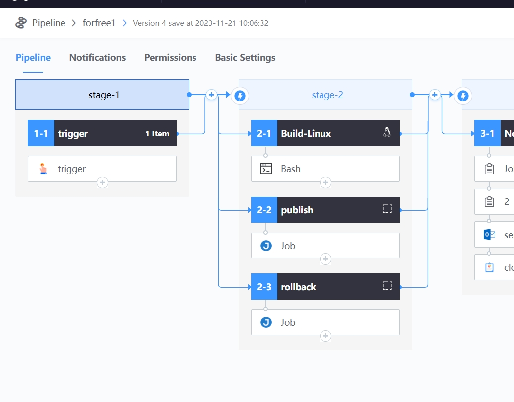
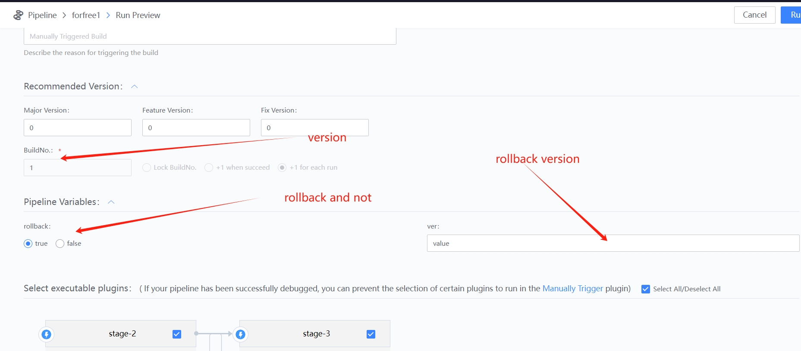
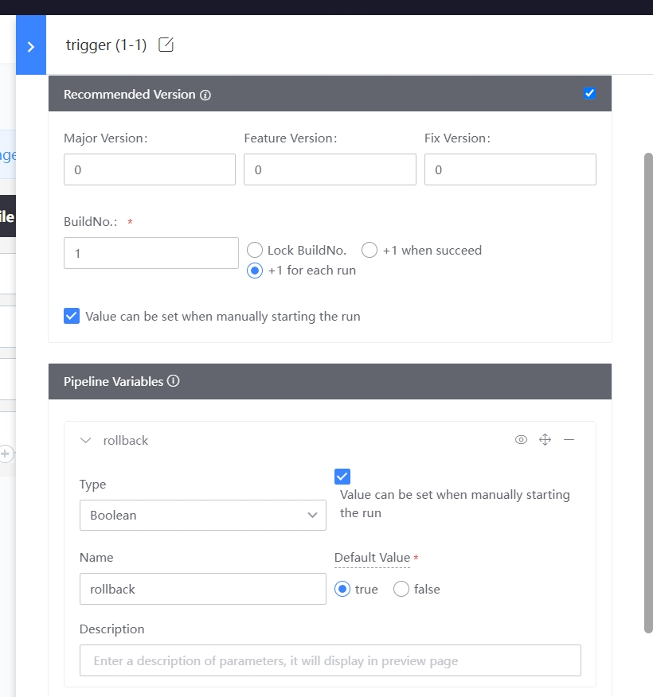
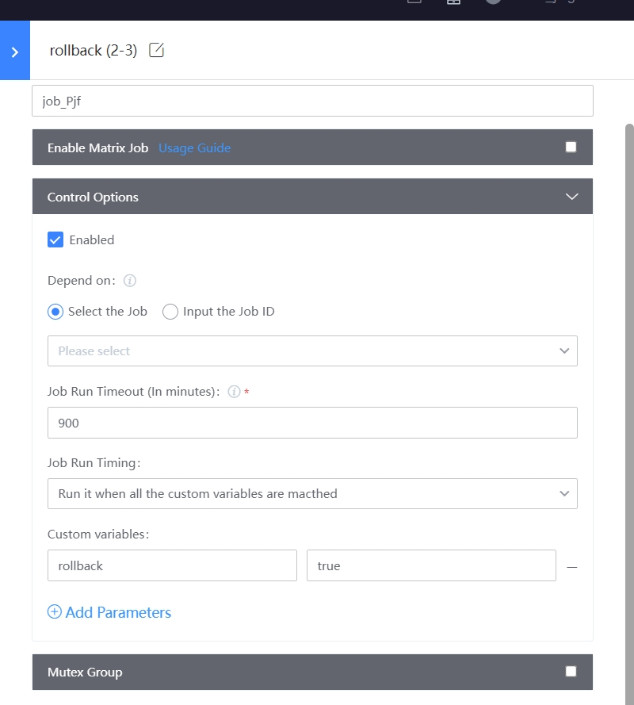
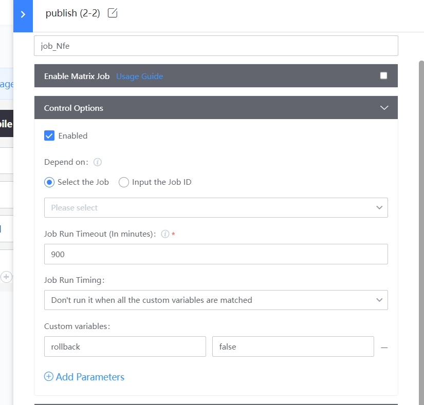

 # Release and Rollback 

 ## Keywords: Release, Rollback 

 ## Business Name Challenges 

 For SRE, the Release and Rollback Flow are mechanically fixed. Some aspects, such as Pull Code down for source dependency packaging, are complex, time-consuming and totalTime. 

 ## Advantages of BK-CI 

 approve BK-CI, various Flow links of Release and Rollback are assembled into different Plugin, and One Pipeline connects the whole CI/CD process to realize Business Name release and rollback Operation. 

 ## Solution 

 1. setting the following Pipeline 

 For information only 

  

 2. Pipeline setting 

 When Start Up Pipeline, you can select Parameter, whether to Release or Rollback; If it is Rollback, you need to specify the rollback versionNum. We have added Pipeline Parameter to control the version number, Rollback version: number and rollback Operation. The Pipeline runs interface has the following options (here is only example) 

  

 The Plugin Config is as follows: 

  

 3. Compile, package and Archive 

 Compile packaging should only be execute at Release build, No Need Rollback time; We use the BK-CI execute condition options to control whether to perform this step, the red box part, here will determine whether Pipeline Parameter rollback is true, if false, SKIP the compilation packaging step 

  

 4. Release and Rollback 

 Control which Branch execute approve Pipeline customVar 

  

 This is just One simple Scene demo. The actual Release and Rollback step are much more complicated than this, and the execute Flow varies from company to company or project to project. The Case, for reference only. 