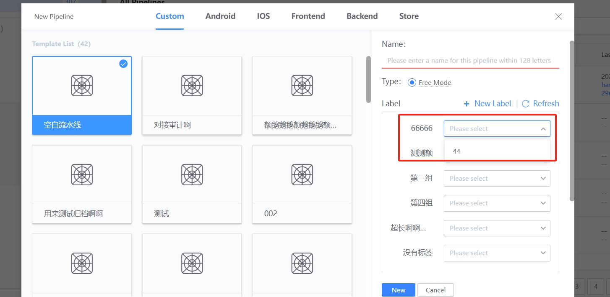
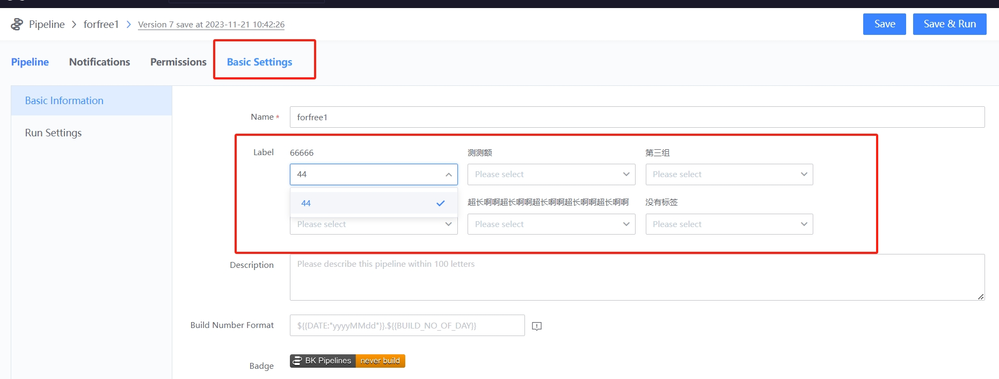
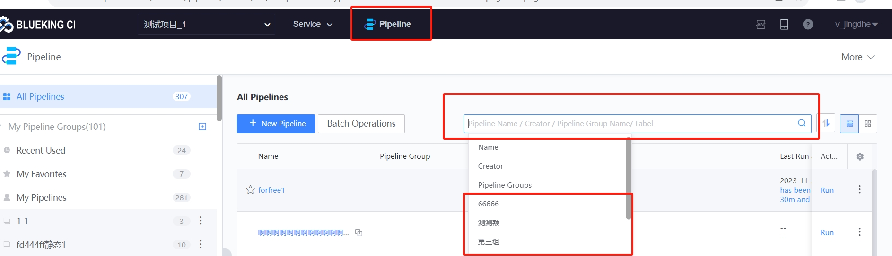
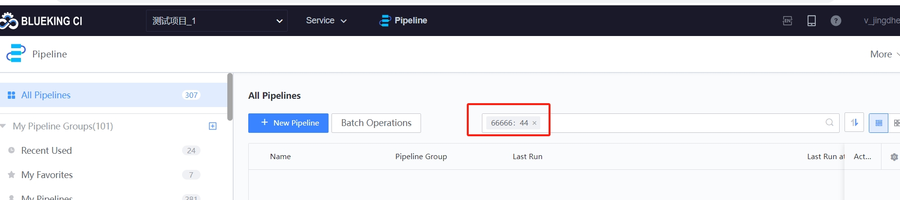

 # Manage a large number of Pipeline 

 ## Keywords: mass Pipeline, label, Service Classification Manage 

 ## Business Name Challenges 

 In the middle and late stages of game operation, One large-scale project may have dozens or even hundreds of Pipeline, which is a great burden for Develop, operation and maintenance search and maintenance. 

 ## Advantages of BK-CI 

 Develop can use the BK-CI label function to label According to the environment, product category and other latitudes, so the Quantity under a single category will be much less.  At the same time, the filter function of BK-CI can be used to realize precise positioning. 

 ## Solution 

 1. On the main page of the Pipeline, click "more-labelManage", refer to the following figure. 

  

 2. In the pop-up page, append group and label as needed.  Note that group and label are a One-many relationship.  Refer to the figure below 

  

 3. label the addPipeline 

 On the Pipeline homepage, when add pipeline, you will see the environment and purpose group on the Right. You can select according to the actual situation.  Refer to the figure below 

  

 4. label the stock Pipeline 

 Open Pipeline edit interface and select baseSetting to see the group and label of settings.  Refer to the figure below 

  

 5, accurate filter 

 click filter button in the main interface of the Pipeline, and enter the corresponding item information in the open interface to accurately filter. 

  

  