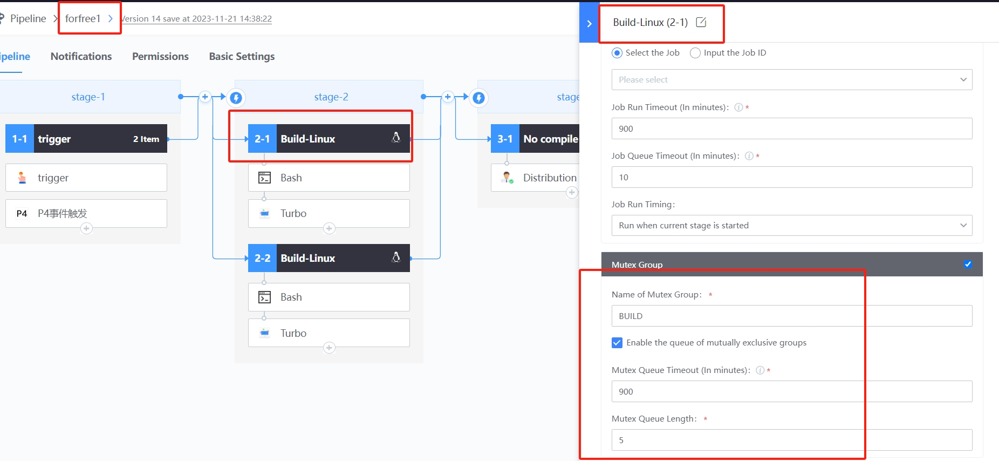
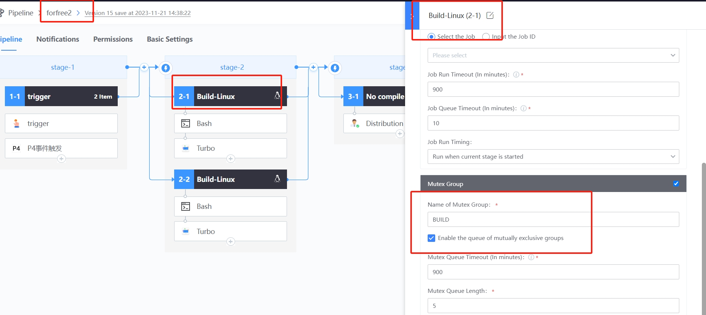

 # Pipeline Mutex and QUEUE Manage 

 ## Keywords: mutual exclusion, QUEUE 

 ## Business Name Challenges 

 When a Business Name execute build, it usually encounters the situation that different Pipeline need to be mutually exclusive. For example, a Business Name has two Pipeline, One for client packaging and the other for service packaging. These two pipelines Must be mutually exclusive, otherwise an error will occur. 

 ## Advantages of BK-CI 

 BK-CI mutex group function, can be achieved on the agent, Set the same mutex group, the first to Start Up the implementation, after the start of the QUEUE. 

 ## Solution 

 1. Please refer to the following figure. In two different Pipeline Set, check "mutexGroup", and the mutualGroupName are the same. 

  

  