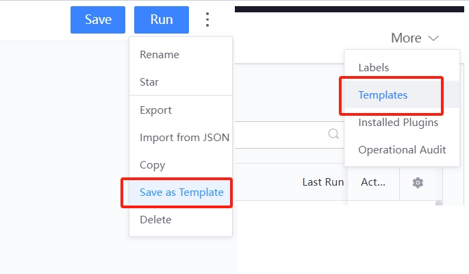
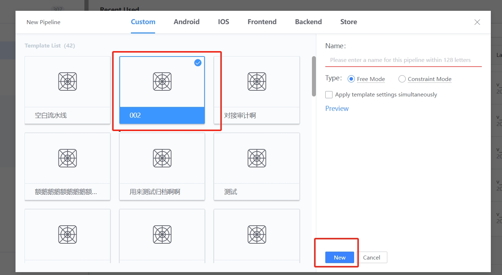
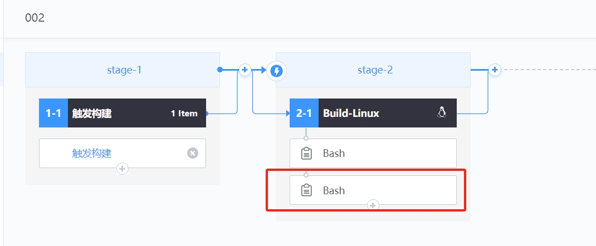
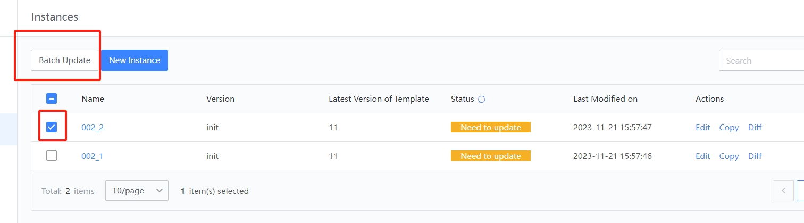
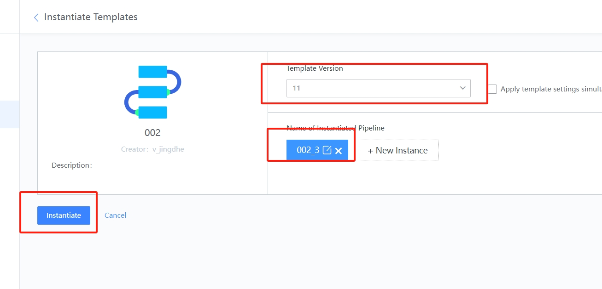
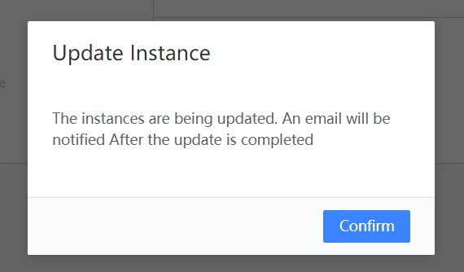
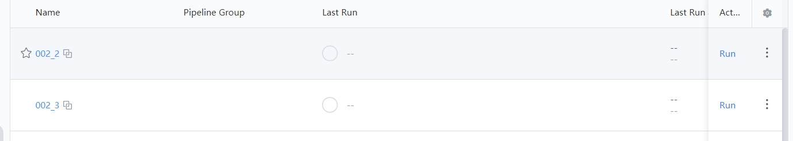
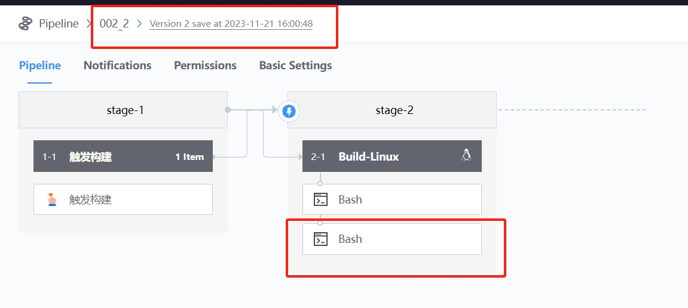

 # Template and copy of Pipeline 

 ## Keywords: Pipeline Template, copy 

 ## Business Name Challenges 

 Over time, the project will have multiple Branch version; The core Task of the Pipeline corresponding to each Branch are similar, and the differences may be: Different agent, different branch, or different language directories; When the core of the Pipeline changed, it is usually necessary to Revise each pipeline mechanically, which is Efficiency and error-prone. 

 ## Advantages of BK-CI 

 BK-CI Pipeline templates and copy capabilities allow user on the same project to create or maintain pipelines without having to Fill In extensive common setting. 

 ## Solution 

 ● Template create 

 The template can be obtained approve the "saveAsTemplate" entry in the upper right corner of the Pipeline edit interface; In Pipeline main interface, more-templateManage interface, perform template management. 

  

  

 ● Template maintenance 

 Version Management: used to save Pipeline templateVersion of different periods, convenient for quick rollback and archiving. 

  

  

 When One new Pipeline is Generate approve this template, the method of "addPipeline-> select Template-> freedomMode" is adopted 

 As shown in the figure below, for One add Pipeline, it is particularly fast, adjust some differentiated Parameter, and you can put it into production. 

  

 However, if there are multiple parallel Pipeline at the same time, it will be tired to maintain. One common Revise may cause all pipelines under this template to be manual Operation maintain consistency.  instanceManage provided One easy way to do this. 

 click "instantiate" to create multiple pipelineInstance at the same time; 

  

  

  

 If we need to make changes to two of the above three Pipeline: To new One task, just Revise the template "test-5.5" and save 

  

  

 On the instanceManage page, check the Pipeline to be changed, and click batchUpdate to complete the updateDialogTitle Operation. 

  

  

  

 It can be found that the total number of 2 Pipeline Plugin that need to be changed has changed from "3" to "4". 

  

  

 In this way, if you make common Revise to multiple Pipeline, you don't have to mechanically change each pipeline. 