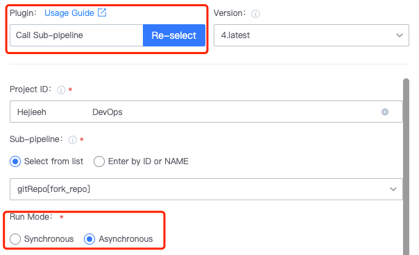

 # Calls between different Pipeline 

 ## Keywords: subPipeline 

 ## Business Name Challenges 

 In our daily build, in order to facilitate subsequent maintenance, we usually separate some common parts to form a "common Pipeline" for Other pipelines to call; Or, in some Scene, Pipeline runs is required to have a sequence, and pipeline A is executed, and then pipeline B is executed. 

 ## Advantages of BK-CI 

 BK-CI implements call execute between different pipelines approve "subPipeline" Plugin 

 ## Solution 

 1. First createPipeline B as a subPipeline 

 2. createPipeline A and call pipeline B in A 

 select the call pipeline Plugin, execute synchronously and asynchronously, and Fill In the var Parameter of the subPipeline 

  

 At the same time also divided into synchronous and asynchronous call execute 

 ● Synchronization 

 After the execute of the sub-pipeline is completed, the Plugin calling the subPipeline is considered to be SUCCEED, and the execution result of the sub-pipeline is consistent with that of the plug-in 

 ● Asynchronous 

 The Plugin only execute the calling subPipeline, and the execution of the plug-in ends when the execution of the calling command ends. Success the sub-pipeline is triggered successfully, the execution of the plug-in succeeds, and if the trigger failed, the plug-in fails. Whether the Run result of the sub-pipeline is successful or not does not affect the execution result of the plug-in. 