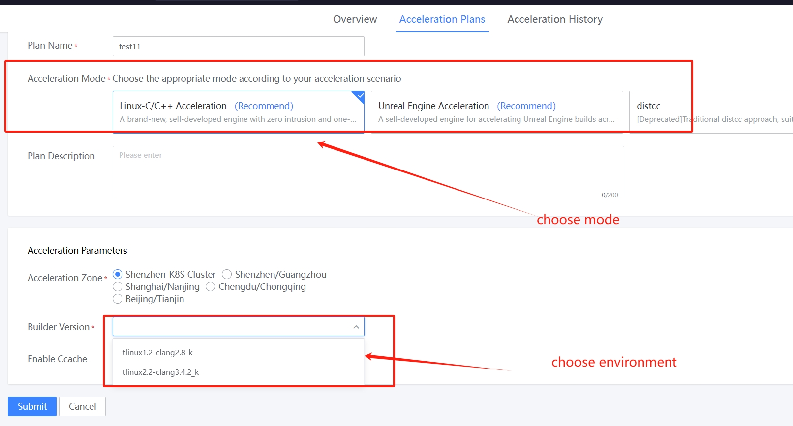
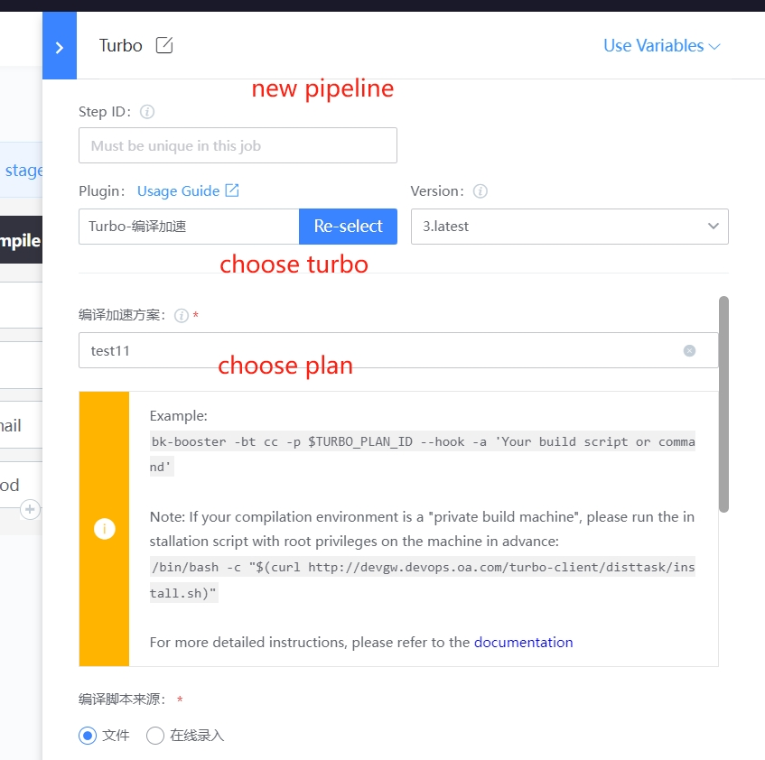

 # c/c++ background Code Turbo 

 ## Keywords: c/c++, Turbo 

 ## Business Name Challenges 

 After the game Enter the Test period, with the continuous increase of functions, the amount of Code and complexity also rose sharply, and code compilation took up a lot of time in program development, especially for programmers who used C++ as a static language as their main daily working language.  Some large project often take tens of minutes or even hours to complete the compilation process. 

 ## Advantages of BK-CI 

 BK-CI provided One set of compilation solutions based on distributed compilation technology, cache technology and container technology, aiming to provide user with efficient, stable and convenient Turbo service. 

 Tencent internal multiple games, C/C++ compilation time from an average of 1h to about 15 minutes. 

 ## Solution 

  

  

  

  