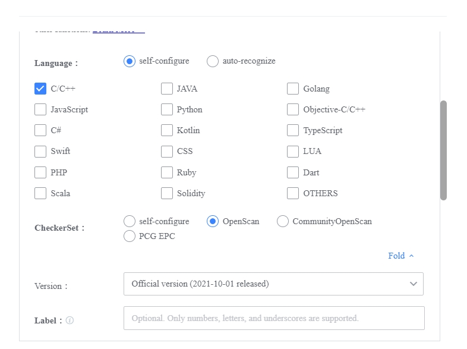
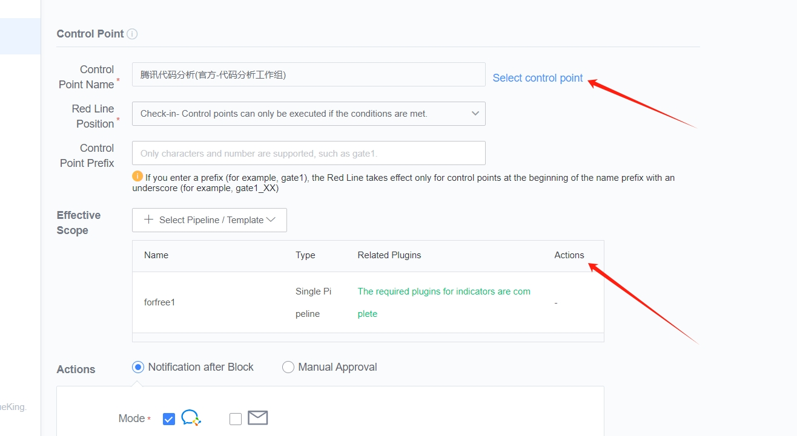
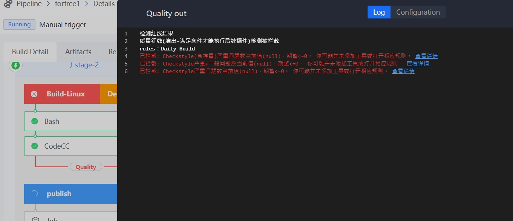

 # Use Gate at Merge Request 

 ## Keywords: MR, Gate 

 ## Business Name Challenges 

 In actual development, we Manage Branch as follows: 

 The master Branch is very stable and is only used to Release New version. 

 Code development is on the dev Branch, which is unstable, and at some point, such as when the Release, the dev branch is merged into the master; 

 Developers Everyone does Code development on the dev Branch, everyone has their own branch, and it is OK to merge to the dev branch from time to time. 

 Then when the Develop's Branch merges into dev, a Merge Request and Code review are required. 

 ## Advantages of BK-CI 

 BK-CI Gate controls the behavior of the Pipeline approve Set standard so that the output Must Meets The the specifications.  It can guarantee the quality of software products in Scene such as Git Merge Request, daily build, version transfer, and Release. 

 ## Solution 

 create One Pipeline and append "Git event Triggers".  Select Merge Request Hook as the Git Event type and check "submit lock at the same time". 

  

  

 2. There is One entry for atoms that can be configured as Gate control points in Blueking Code Check Center, etc., which is used to quickly create a quality Red-line rule. 

  

 click "Return" to Enter the interface of create Gate. At this time, the control point and Effective Range have been auto select. 

  

 select the required metrics. for example, you can select the metric set specified by Tencent's external open source code to ensure that the incorporated Code Meets The Tencent's external open source code specification. 

  

 At this time, launch MR and Code review, which will trigger Pipeline scanning. If the code does not Meets The the requirements of Gate, Pipeline fail will be Display. click detail Go To Watch specific reasons. 

  