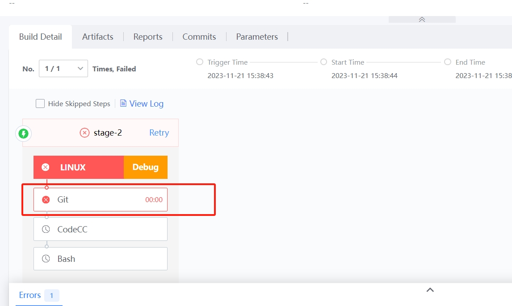

 # Pipeline failed problem positioning 

 ## Keywords: Problem Location, Visualization, Labor Saving 

 ## Business Name Challenges 

 When the Pipeline failed and an error is reported, the Develop team needs to sort out the positioning problem of the whole Pipeline, which consumes the development manpower. 

 ## Advantages of BK-CI 

 approve BK-CI's "TJS"(Task, Job, Stage) structure, complex Pipeline can be build visually through drag-and-drop, click, and other Operation.  With the help of the "red" identification of the execute status of the Task item, the team can quickly and intuitively locate the Pipeline failed problem and obtain the Execution Log, which decreased the manpower investment of the engineers in the problem location and troubleshooting. 

 ## Solution 

 If the compilation failed, you only need to check the Task whose execute status Display "red", instead of checking the All compilation process; 

  

 click the "red" gateway to Enter the Log details page to view the Error log. 

  